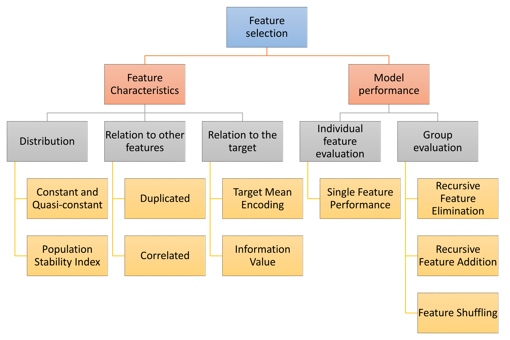

.. -*- mode: rst -*-
.. _selection_user_guide:

.. currentmodule:: feature_engine.selection

Feature Selection
=================

Feature-engine's feature selection transformers identify features with low predictive
performance, and drop them from the dataset. To our knowledge, the feature selection
algorithms supported by Feature-engine are not yet available in other libraries.

Selection Mechanism Overview
----------------------------

Feature-engine's selectors select features based on 1 of 3 main mechanisms: they look at
the feature's characteristics, or they look at the performance of a single feature, or
they evaluate the performance of a feature within the group of features.

   Selection process characteristics

For example, in the first pillar, features will be selected based on the diversity of their
values, or their relation to other features. This way, features that show the same value in all
or almost all the observations will be dropped, or duplicated or correlated features will be dropped.

Algorithms that select features based on individual feature performance will select features
by either training a machine learning model using an individual feature, or estimating model
performance with a single feature using a prediction proxy.

Algorithms that select features based on their performance within a group of variables, will
normally train a model with all the features, and then remove or add or shuffle a feature and
re-evaluate the model performance.

These methods are normally geared to improve the overall performance of the final machine learning model
as well as reducing the feature space.

Feature-engine also hosts methods to select features based on their characteristics, that may or
may not affect model performance per se, but are required by regulations in some sectors.

Selectors Characteristics Overview
----------------------------------

Some Feature-engine's selectors work with categorical variables off-the-shelf and/or allow
missing data in the variables. These gives you the opportunity to quickly screen features
before jumping into any feature engineering.

In the following image we highlight the main Feature-engine selectors characteristics:

   Summary of Feature-engine's selectors main characteristics

In short, selection procedures that require training a machine learning model from Scikit-learn
require numerical variables without missing data. Selection procedures based on correlation work
only with numerical variables but allow missing data. Methods that determine duplication or
the number of unique values can work with both numerical and categorical variables and support
missing data as well.

The :class:`SelectBySingleFeaturePerformance()` uses the target mean value as proxy for prediction,
replacing categories or variable intervals by these values and then determining a performance metric.
This, it is suitable for both categorical and numerical variables. In its current implementation,
it does not support missing data.

Throughout the user guide, you will find more details about each of the feature selection procedures.

Say something about :class:`DropHighPSIFeatures()`.

Transformers
------------

.. toctree::
   :maxdepth: 1

   DropFeatures
   DropConstantFeatures
   DropDuplicateFeatures
   DropCorrelatedFeatures
   SmartCorrelatedSelection
   SelectByShuffling
   SelectBySingleFeaturePerformance
   SelectByTargetMeanPerformance
   RecursiveFeatureElimination
   RecursiveFeatureAddition
   DropHighPSIFeatures

Additional Resources
--------------------

More details about feature selection can be found in the following resources:

- `Feature Selection Online Course <https://www.udemy.com/course/feature-selection-for-machine-learning/?referralCode=186501DF5D93F48C4F71>`_
- `Feature Selection for Machine Learning: A comprehensive Overview <https://trainindata.medium.com/feature-selection-for-machine-learning-a-comprehensive-overview-bd571db5dd2d>`_

