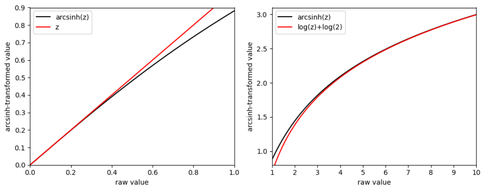
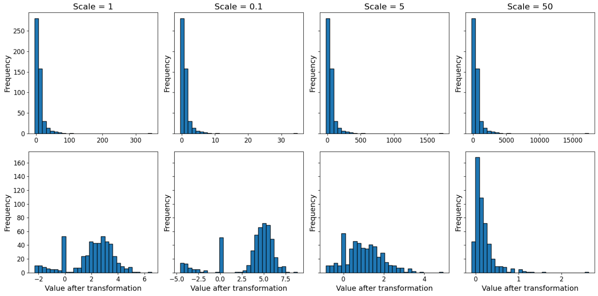
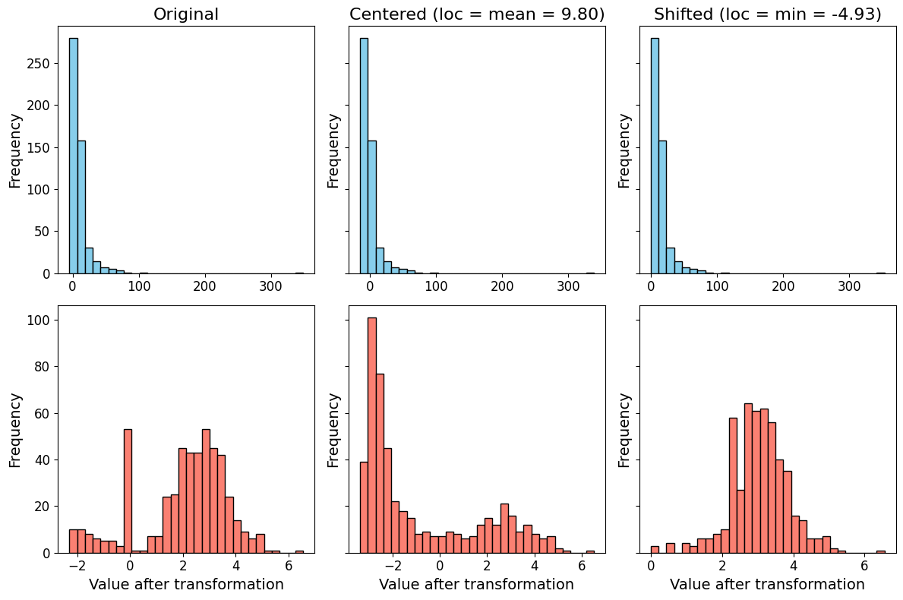
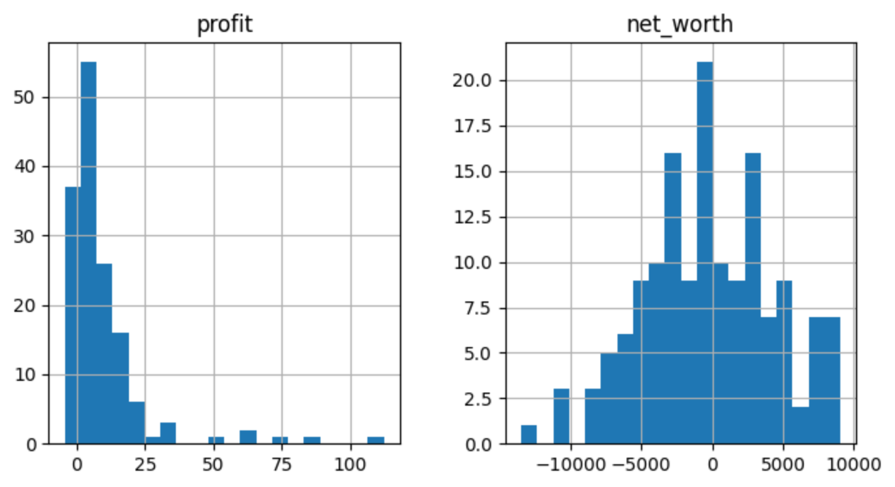
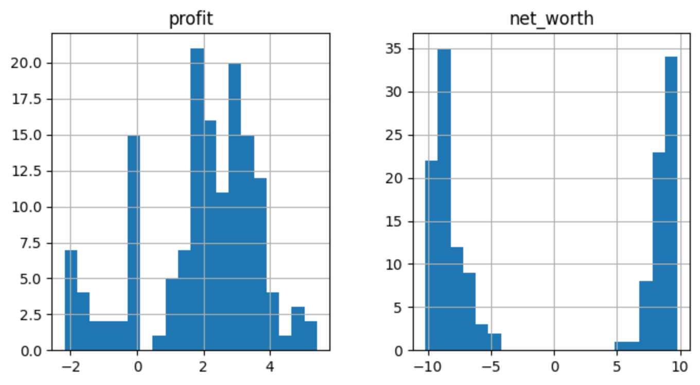
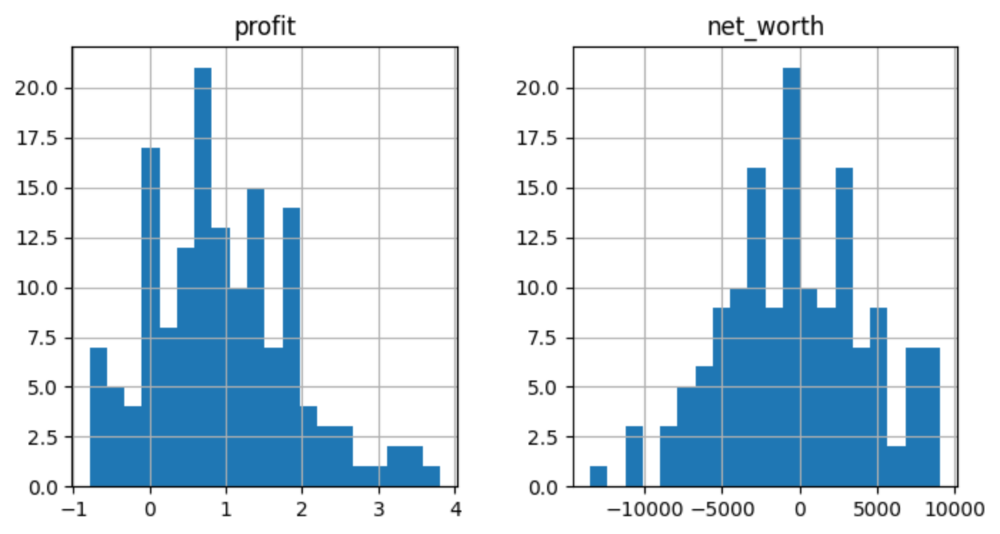
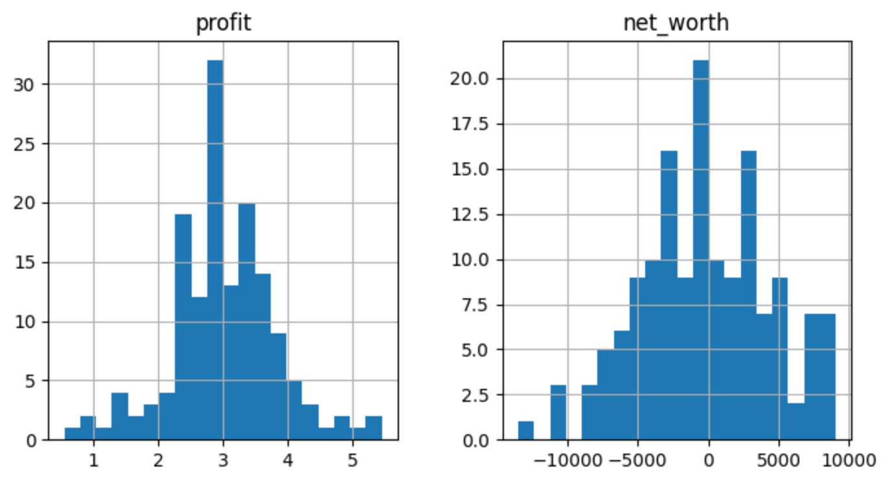
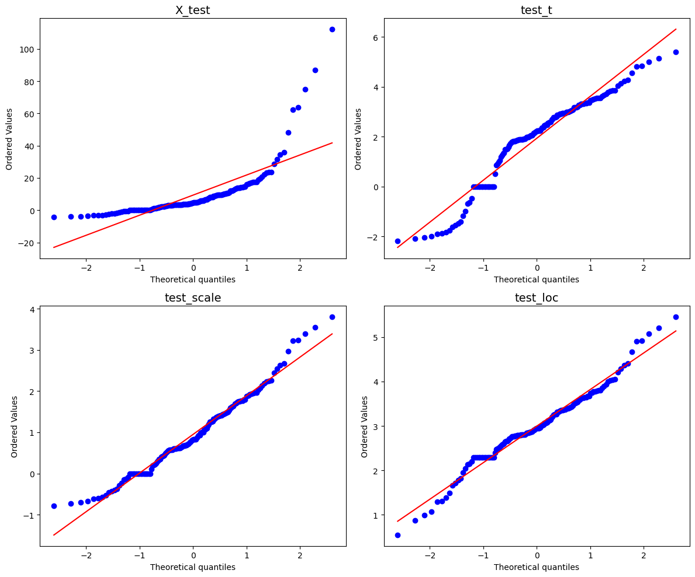

.. _arcsinh_transformer:

.. currentmodule:: feature_engine.transformation

ArcSinhTransformer
==================

The inverse hyperbolic sine (or arcsinh) transformation is a variance-stabilizing
transformation that achieves results similar to the logarithmic transformation,
while retaining zero values in a variable, something the logarithm cannot do. It has
gained popularity in recent years; therefore, we add support for it in Feature-engine.

Variance stabilizing transformations
------------------------------------

Variance stabilizing transformations are commonly used in regression analysis to make
skewed data more evenly distributed, approximate normality, or reduce heteroscedasticity.
One of the most commonly used transformations is the logarithm. However, the logarithm
transformation has one limitation: it is not defined for the value 0.

Given that many variables often include meaningful zero-valued observations for which
the logarithm is undefined, researchers developed a number of alternatives to try and retain
those zeros.

The simplest alternative consists of adding 1 (or a constant value to the variable). In fact,
the Box-Cox transformation is a generalized version of power transformations that automatically
introduces a shift in 0 valued observations before applying the logarithm.

However, adding 1 (or a constant) before applying a log transformation is arbitrary and can
distort interpretation, particularly for small values and near zero.

In recent years, the inverse hyperbolic sine (or arcsinh) transformation has grown in
popularity because it is similar to a logarithm, and it allows retaining zero-valued
(and even negative-valued) observations.

Inverse Hyperbolic Sine Transformation
--------------------------------------

The inverse hyperbolic sine (IHS) transformation is defined as follows:

.. math::

   x' = \operatorname{arcsinh}(x) = \ln\left(x + \sqrt{x^2 + 1}\right)

The IHS transformation works with data defined on the whole real line including
negative values and zeros. For large values of x, the IHS behaves like a log
transformation. For small values of x, or in other words as x approaches 0, IHS(x)
approaches x.

The following code recreates the effect of the IHS transformation on small and big values
of x:

.. code:: python

    import numpy as np
    import matplotlib.pyplot as plt

    # Create data
    z_small = np.linspace(0, 1, 200)
    z_large = np.linspace(1, 10, 200)

    # IHS transformation
    arcsinh_small = np.arcsinh(z_small)
    arcsinh_large = np.arcsinh(z_large)

    # Create figure
    fig, axes = plt.subplots(1, 2, figsize=(10, 4))

    # ---- Left panel ----
    axes[0].plot(z_small, arcsinh_small, color="black", label="arcsinh(z)")
    axes[0].plot(z_small, z_small, color="red", label="z")
    axes[0].set_xlabel("raw value")
    axes[0].set_ylabel("arcsinh-transformed value")
    axes[0].legend()
    axes[0].set_xlim(0, 1)
    axes[0].set_ylim(0, 0.9)

    # ---- Right panel ----
    axes[1].plot(z_large, arcsinh_large, color="black", label="arcsinh(z)")
    axes[1].plot(z_large, np.log(z_large) + np.log(2), color="red", label="log(z)+log(2)")
    axes[1].set_xlabel("raw value")
    axes[1].set_ylabel("arcsinh-transformed value")
    axes[1].legend()
    axes[1].set_xlim(1, 10)
    axes[1].set_ylim(0.8, 3.1)

    plt.tight_layout()
    plt.show()

In the following image, we see that the IHS transformation retains the values of x
when x is small (left panel), or behaves like the log(x) (plus a shift) when x is large
(right panel):

Variable Scaling before IHS
---------------------------

The effect of the IHS transformation depends on the magnitude of the values to transform.
In general, if the values are smaller than 3, the IHS results in values similar to the original
variable, and hence, the transformation is not useful to reduce skewness.

In contrast, if one chooses the unit of measurement for a variable in a way that all
values are rather large (e.g., larger than 3), the IHS transformation is almost identical
to the log transformation. Hence, to make a useful transformation, it's suggested to "rescale"
the original variable to greater values (i.e., multiply by a positive constant).

However, when the variable to transform contains zeros as values, it is difficult to scale
this variable in a way that all values are rather large because zero values remain zero
no matter what unit of measurement is used.

Let's compare the effect of rescaling the variable before applying the IHS transformation:

.. code:: python

    import numpy as np
    import matplotlib.pyplot as plt

    # -----------------------------
    # 1. Generate synthetic variable
    # -----------------------------
    np.random.seed(42)
    n = 500

    # Skewed positive values (like log-normal)
    positive = np.random.lognormal(mean=2, sigma=1, size=400)

    # Add zeros and some negative values
    zeros = np.zeros(50)
    negatives = np.random.uniform(-5, 0, 50)

    x = np.concatenate([positive, zeros, negatives])

    # -----------------------------
    # 2. Define IHS transform with scale
    # -----------------------------
    def ihs_transform(x, scale):
        return np.arcsinh(x / scale)

    # -----------------------------
    # 3. Define scenarios
    # -----------------------------
    scales = [1, 0.1, 5, 50]

    scenarios = {}
    for scale in scales:
        title = f"Scale = {scale}"
        # Top row: original variable multiplied by scale
        original_scaled = x * scale
        # Bottom row: IHS-transformed
        transformed = ihs_transform(x, scale=scale)
        scenarios[title] = (original_scaled, transformed)

    # -----------------------------
    # 4. Plotting with larger fonts
    # -----------------------------
    fig, axes = plt.subplots(2, len(scenarios), figsize=(16, 8), sharey='row')

    # Font sizes
    title_fontsize = 16
    label_fontsize = 14
    tick_fontsize = 12

    for i, (title, (original, transformed)) in enumerate(scenarios.items()):
        # Top row: scaled original variable
        axes[0, i].hist(original, bins=30, edgecolor='black')
        axes[0, i].set_title(title, fontsize=title_fontsize)
        axes[0, i].set_ylabel("Frequency", fontsize=label_fontsize)
        axes[0, i].tick_params(axis='both', labelsize=tick_fontsize)

        # Bottom row: IHS-transformed
        axes[1, i].hist(transformed, bins=30, edgecolor='black')
        axes[1, i].set_xlabel("Value after transformation", fontsize=label_fontsize)
        axes[1, i].set_ylabel("Frequency", fontsize=label_fontsize)
        axes[1, i].tick_params(axis='both', labelsize=tick_fontsize)

    plt.tight_layout()
    plt.show()

In the following image, we see the resulting IHS transformation after multiplying the
original variable by 0.1 (reducing the scale), 5 or 50 (increasing the scale). In the top
panels we see the original distribution (left) or the original distribution after re-scaling.
In the bottom panels we see the effect of the inverse hyperbolic sine transformation:

The fundamental message of this experiment is that:

- Changing the variable scale will affect the variance stabilizing power of the IHS transformation
- Reducing the scale (multiplying by values <1) increases the separation of larger values from zero values (second panel), which is probably not what we want
- Increasing the scale substantially, may also result in suboptimal distributions, as shown on the right panel

Hence, choosing the right scale, is key to achieving the desired results.

Variable Centering before IHS
-----------------------------

Another way to obtain better results using the inverse hyperbolic sine transformation is
to shift the data (i.e., to add a constant). This is particularly useful when the variable
has negative values, to transition from negative logarithmic behavior to positive logarithmic
behavior.

Let's compare the effect of shifting the original variable distribution before applying the
IHS transformation. With the following code, we apply the IHS to a variable containing
zero and negative values after centering at its mean, or at its minimum value (shifting all
negative values to positive):

.. code:: python

    import numpy as np
    import matplotlib.pyplot as plt

    # -----------------------------
    # 1. Generate synthetic variable
    # -----------------------------
    np.random.seed(42)
    n = 500

    # Skewed positive values (like log-normal)
    positive = np.random.lognormal(mean=2, sigma=1, size=400)

    # Add zeros and some negative values
    zeros = np.zeros(50)
    negatives = np.random.uniform(-5, 0, 50)

    x = np.concatenate([positive, zeros, negatives])

    # -----------------------------
    # 2. Define IHS transform
    # -----------------------------
    def ihs_transform(x, loc=0):
        return np.arcsinh(x - loc)

    # -----------------------------
    # 3. Define scenarios
    # -----------------------------
    loc_mean = x.mean()
    loc_min = x.min()

    # Each scenario: (top histogram data, bottom transformed)
    scenarios = {
        "Original": (x, ihs_transform(x, loc=0)),
        f"Centered (loc = mean = {loc_mean:.2f})": (x - loc_mean, ihs_transform(x, loc=loc_mean)),
        f"Shifted (loc = min = {loc_min:.2f})": (x - loc_min, ihs_transform(x, loc=loc_min)),
    }

    # -----------------------------
    # 4. Plotting with larger fonts, square figure
    # -----------------------------
    fig, axes = plt.subplots(2, len(scenarios), figsize=(12, 8), sharey='row')

    # Font sizes
    title_fontsize = 16
    label_fontsize = 14
    tick_fontsize = 12

    for i, (title, (top_data, transformed)) in enumerate(scenarios.items()):
        # Top row: original or shifted variable
        axes[0, i].hist(top_data, bins=30, edgecolor='black', color='skyblue')
        axes[0, i].set_title(title, fontsize=title_fontsize)
        axes[0, i].set_ylabel("Frequency", fontsize=label_fontsize)
        axes[0, i].tick_params(axis='both', labelsize=tick_fontsize)

        # Bottom row: IHS-transformed
        axes[1, i].hist(transformed, bins=30, edgecolor='black', color='salmon')
        axes[1, i].set_xlabel("Value after transformation", fontsize=label_fontsize)
        axes[1, i].set_ylabel("Frequency", fontsize=label_fontsize)
        axes[1, i].tick_params(axis='both', labelsize=tick_fontsize)

    plt.tight_layout()
    plt.show()

In the following image, we observe the original distributions (top panels) before or after shifting its
values to the variable mean (middle) or variable minimum (right). In the bottom panels, we
see the variables after the ISH transformation:

We observe that making all variable values positive, results in the best transformation
(right panel), as the transformed variable has a more Gaussian looking distribution.
Centering the variable at the mean reduces the difference between larger and zero and
negative values after the transformation (middle panel).

Limitations of the IHS
----------------------

As with all variance stabilizing transformations, the IHS comes with limitations, being,
the result of the transformation largely depends on the variable scale, by the own definition
of the transformation.

That means, that the IHS is not a one-stop solution for the transformation of numerical variables
with zero and negative values. Instead, we need to review the result of the transformation before
using it in our machine learning pipelines.

In fact, to improve the effect of the transformations, scaling and shifting have been proposed,
which, in a sense, kill the beauty of this function, which was to avoid adding a
constant before applying the logarithm. So, use it with care.

ArcSinhTransformer
------------------

Feature-engine's :class:`ArcSinhTransformer()` applies the inverse hyperbolic sine transformation
to numerical variables. It also supports centering and shifting the variables as follows:

.. math::
    y = \text{arcsinh}\left(\frac{x - \text{loc}}{\text{scale}}\right)

In short, the loc parameter moves the distribution of the original variable to the right or left,
whereas the scale parameter re-scales the variable. Here: smaller values of scale, reduce the
separation of larger values of the variable from 0.

Unlike :class:`LogTransformer()`, :class:`ArcSinhTransformer()` can handle
zero and negative values without requiring any preprocessing (or so we wanted to think).

Python demo
-----------

In this demo, we'll show how to use the inverse hyperbolic sine transformation with care.

Let's create a dataframe with 2 variables containing positive, zero and negative
values, and then split the dataset into a training and a testing set:

.. code:: python

    import numpy as np
    import pandas as pd
    import matplotlib.pyplot as plt
    from sklearn.model_selection import train_test_split

    from feature_engine.transformation import ArcSinhTransformer

    # Create sample data with positive and negative values
    np.random.seed(42)

    # Skewed positive values (like log-normal)
    positive = np.random.lognormal(mean=2, sigma=1, size=400)
    zeros = np.zeros(50)
    negatives = np.random.uniform(-5, 0, 50)
    x = np.concatenate([positive, zeros, negatives])

    X = pd.DataFrame({
        'profit': x,
        'net_worth': np.random.randn(500) * 5000,
    })

    # Separate into train and test
    X_train, X_test = train_test_split(X, test_size=0.3, random_state=0)

    print(X.head())

In the following output, we see the created dataframe:

.. code:: python

          profit     net_worth
    0  12.142530  -8516.912197
    1   6.434896   -277.738494
    2  14.121360   1920.327245
    3  33.886946   -163.473740
    4   5.846520 -10337.210500

Let's display histograms with the distributions of these variables:

.. code:: python

    X_test.hist(bins=20, figsize=(8,4))
    plt.show()

In the following image, we see the distributions of the numerical variables:

Let's set up the :class:`ArcSinhTransformer()` to apply the IHS transformation to both
variables, and fit it to the training set:

.. code:: python

    # Set up the arcsinh transformer
    tf = ArcSinhTransformer(variables=['profit', 'net_worth'])

    # Fit the transformer
    tf.fit(X_train)

The transformer does not learn any parameters when applying the fit method. It does
check, however, that the variables are numerical.

We can now transform the variables:

.. code:: python

    # Transform the data
    train_t = tf.transform(X_train)
    test_t = tf.transform(X_test)

    print(train_t.head())

The dataframe with the transformed variables:

.. code:: python

           profit  net_worth
    141  4.000625   9.344656
    383  2.180247   9.553467
    135  4.243288  -7.692116
    493 -1.897234   9.842227
    122  4.096218   7.971689

To evaluate the effect of the transformation, let's plot the histograms of the transformed
variables:

.. code:: python

    test_t.hist(bins=20, figsize=(8,4))
    plt.show()

In the following figure, we see that while the arcsinh transformation seemed to stabilize the
variance of the variable profit, it does an awful job for the variable net-worth:

Scaling the distribution before arcsinh
~~~~~~~~~~~~~~~~~~~~~~~~~~~~~~~~~~~~~~~

:class:`ArcSinhTransformer()` supports location and scale parameters to
center and rescale data before transformation.

We discussed previously that re-scaling the variables before applying the arcsinh transformation
can help achieve better variance stabilizing results.

Let's rescale the variable profit before applying the arcsinh transformation and then display
the histogram of the resulting dataframe:

.. code:: python

    tf = ArcSinhTransformer(variables=['profit'], scale=5)

    # Fit the transformer
    tf.fit(X_train)

    # Transform the data
    train_scale = tf.transform(X_train)
    test_scale = tf.transform(X_test)

    test_scale.hist(bins=20, figsize=(8,4))
    plt.show()

In the following image, we see that decreasing the scale of profit (we divided it by 5)
results in a more stable distribution (more on this later):

Net worth was untransformed, so we see the original distribution.

Shifting the distribution before arcsinh
~~~~~~~~~~~~~~~~~~~~~~~~~~~~~~~~~~~~~~~~

We mentioned previously that shifting the variables before applying the arcsinh transformation
can help achieve better variance stabilizing results.

Let's shift the variable profit before applying the arcsinh transformation, to make all its
values positive. After that, we display the histogram of the resulting dataframe:

.. code:: python

    loc = X_train['profit'].min()
    tf = ArcSinhTransformer(variables=['profit'], loc=loc)

    # Fit the transformer
    tf.fit(X_train)

    # Transform the data
    train_loc = tf.transform(X_train)
    test_loc = tf.transform(X_test)

    test_loc.hist(bins=20, figsize=(8,4))
    plt.show()

In the following image, we see that moving the variable profit towards positive values
results in a more stable distribution (more on this later):

Net worth was untransformed, so we see the original distribution.

Which transformation is better?
~~~~~~~~~~~~~~~~~~~~~~~~~~~~~~~

To analyse the effect of the IHS transformation before or after scaling and shifting the
profit variable distribution, let's plot Q-Q plots:

.. code:: python

    import matplotlib.pyplot as plt
    import scipy.stats as stats

    # List of dataframes and titles
    dfs = [X_test, test_t, test_scale, test_loc]
    titles = ['X_test', 'test_t', 'test_scale', 'test_loc']

    # Create figure with 2x2 subplots
    fig, axes = plt.subplots(2, 2, figsize=(12, 10))

    for ax, df, title in zip(axes.flatten(), dfs, titles):
        # Q-Q plot for profit variable
        stats.probplot(df['profit'], dist="norm", plot=ax)
        ax.set_title(title, fontsize=14)

    plt.tight_layout()
    plt.show()

In the following image, we see that the inverse hyperbolic sine makes the distribution
of profit follow a normal distribution more closely (top right panel). While scaling and
shifting the variable makes transformation even better (bottom panels):

Inverse transformation
~~~~~~~~~~~~~~~~~~~~~~

:class:`ArcSinhTransformer()` supports inverse transformation to recover
the original values:

.. code:: python

    # Transform and then inverse transform
    train_t = tf.transform(X_train)
    train_recovered = tf.inverse_transform(train_t)

    print(train_recovered.head())

The recovered data:

.. code:: python

            profit    net_worth
    141  27.306991  5718.770216
    383   4.367737  7046.737201
    135  34.811034 -1095.502644
    493  -3.258723  9405.785347
    122  30.047946  1448.874284

References
----------

For more details on the inverse hyperbolic sine transformation, check the following resources:

1. `How should I transform non-negative data including zeros? <https://stats.stackexchange.com/questions/1444/how-should-i-transform-non-negative-data-including-zeros>`_ (StackExchange)
2. `Interpreting Treatment Effects: Inverse Hyperbolic Sine Outcome Variable <https://blogs.worldbank.org/en/impactevaluations/interpreting-treatment-effects-inverse-hyperbolic-sine-outcome-variable-and>`_ (World Bank Blog)
3. `Burbidge, J. B., Magee, L., & Robb, A. L. (1988). Alternative transformations to handle extreme values of the dependent variable. Journal of the American Statistical Association. <https://www.jstor.org/stable/2288929>`_
4. `Aihounton, Henningsen. (2020). Units of measurement and the inverse hyperbolic sine transformation. The Econometrics Journal. <https://academic.oup.com/ectj/article-abstract/24/2/334/5948096>`_

Tutorials, books and courses
----------------------------

For tutorials about variance stabilizing transformations, check out our online course:

.. figure::  ../../images/feml.png
   :width: 300
   :figclass: align-center
   :align: left
   :target: https://www.trainindata.com/p/feature-engineering-for-machine-learning

   Feature Engineering for Machine Learning

|
|
|
|
|
|
|
|
|
|

Or read our book:

.. figure::  ../../images/cookbook.png
   :width: 200
   :figclass: align-center
   :align: left
   :target: https://www.packtpub.com/en-us/product/python-feature-engineering-cookbook-9781835883587

   Python Feature Engineering Cookbook

|
|
|
|
|
|
|
|
|
|
|
|
|

Both our book and course are suitable for beginners and more advanced data scientists
alike. By purchasing them you are supporting Sole, the main developer of Feature-engine.