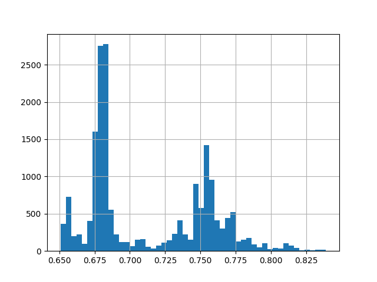
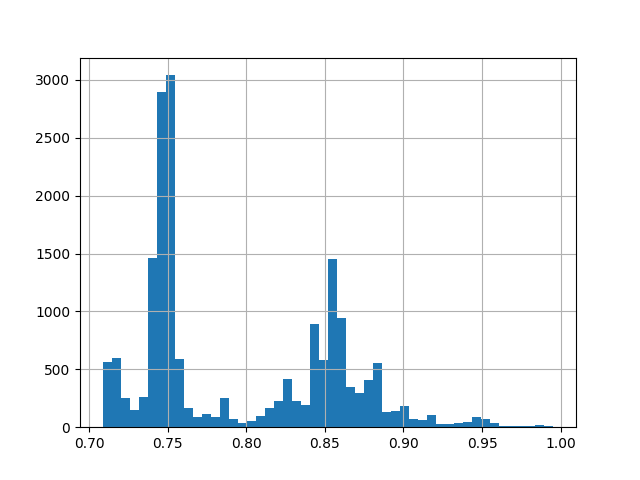

.. _arcsin:

.. currentmodule:: feature_engine.transformation

ArcsinTransformer
=================

The :class:`ArcsinTransformer()` applies the arcsin transformation to
numerical variables.

The :class:`ArcsinTransformer()` only works with numerical variables with values between -1 and +1. If the variable contains a value outside of this range, the transformer will raise an error.

Let's load the california housing dataset and  separate it into train and test sets (more
details about the dataset :ref:`here <datasets>`).

.. code:: python

    import numpy as np
    import pandas as pd
    import matplotlib.pyplot as plt
    from sklearn.model_selection import train_test_split
    from sklearn.datasets import fetch_california_housing

    from feature_engine import transformation as vt
      
    # Load dataset
    cal_housing = fetch_california_housing()
    X = pd.DataFrame(cal_housing.data, columns=cal_housing.feature_names)
    # divide by 50 to obtain values between -1 and +1
    X['Latitude'] = X['Latitude'] / 50
    y = cal_housing.target

    # Separate into train and test sets
    X_train, X_test, y_train, y_test = train_test_split(X, y, test_size=0.1, random_state=0)

Now we want to apply the arcsin transformation to 1 variables in the dataframe:

.. code:: python

    # set up the variable transformer
    tf = vt.ArcsinTransformer(variables = ['Latitude'])

    # fit the transformer
    tf.fit(X_train)

The transformer does not learn any parameters. So we can go ahead and transform the
variables:

.. code:: python

    # transform the data
    train_t= tf.transform(X_train)

Finally, we can plot the original variable distribution:

.. code:: python

    # un-transformed variable
    X_train['Latitude'].hist(bins=50)

And now the distribution after the transformation:

.. code:: python

    # transformed variable
    train_t['Latitude'].hist(bins=50)

More details
^^^^^^^^^^^^

You can find more details about the :class:`ArcsinTransformer()` here:

- `Jupyter notebook <https://nbviewer.org/github/feature-engine/feature-engine-examples/blob/main/transformation/ReciprocalTransformer.ipynb>`_

All notebooks can be found in a `dedicated repository <https://github.com/feature-engine/feature-engine-examples>`_.
