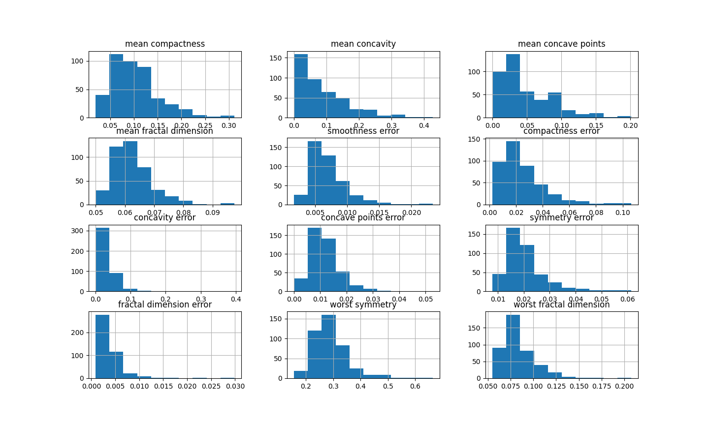
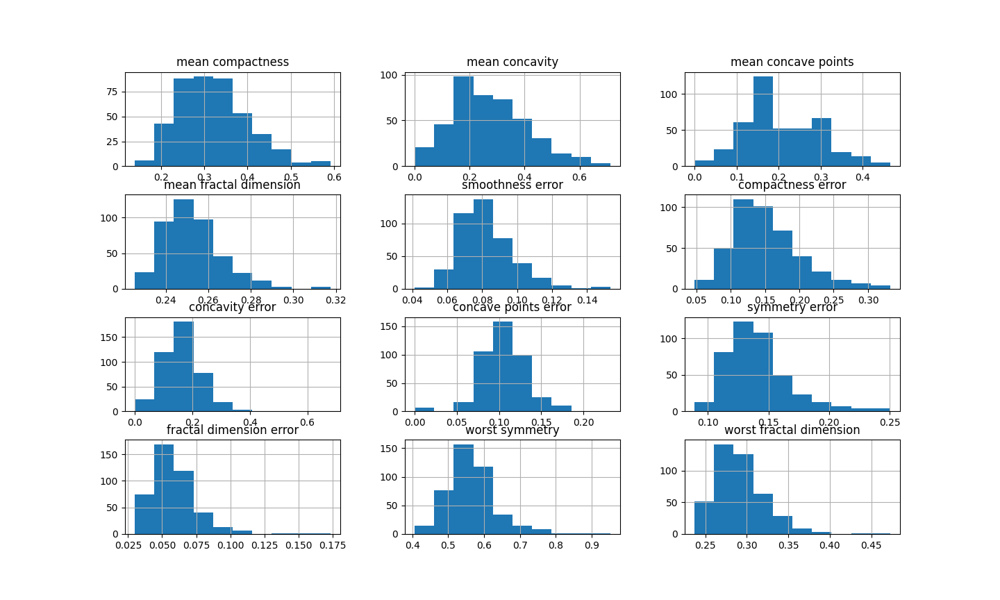

.. _arcsin:

.. currentmodule:: feature_engine.transformation

ArcsinTransformer
=================

The :class:`ArcsinTransformer()` applies the arcsin transformation to
numerical variables.

The arcsine transformation, also called arcsin square root transformation, or
angular transformation, takes the form of arcsin(sqrt(x)) where x is a real number
between 0 and 1.

The arcsin square root transformation helps in dealing with probabilities,
percentages, and proportions.

The :class:`ArcsinTransformer()` only works with numerical variables with values
between 0 and 1. If the variable contains a value outside of this range, the
transformer will raise an error.

Example
~~~~~~~

Let's load the breast cancer dataset from scikit-learn and  separate it into train and
test sets.

.. code:: python

    import numpy as np
    import pandas as pd
    import matplotlib.pyplot as plt
    from sklearn.model_selection import train_test_split
    from sklearn.datasets import load_breast_cancer

    from feature_engine.transformation import ArcsinTransformer
      
    #Load dataset
    breast_cancer = load_breast_cancer()
    X = pd.DataFrame(breast_cancer.data, columns=breast_cancer.feature_names)
    y = breast_cancer.target

    # Separate data into train and test sets
    X_train, X_test, y_train, y_test = train_test_split(X, y, random_state=0)

Now we want to apply the arcsin transformation to some of the variables in the
dataframe. These variables values are in the range 0-1, as we will see in coming
histograms.

First, let's make a list with the variable names:

.. code:: python

    vars_ = [
      'mean compactness',
      'mean concavity',
      'mean concave points',
      'mean fractal dimension',
      'smoothness error',
      'compactness error',
      'concavity error',
      'concave points error',
      'symmetry error',
      'fractal dimension error',
      'worst symmetry',
      'worst fractal dimension']

Now, let's set up the arscin transformer to modify only the previous variables:

.. code:: python

    # set up the arcsin transformer
    tf = ArcsinTransformer(variables = vars_)

    # fit the transformer
    tf.fit(X_train)
    
The transformer does not learn any parameters when applying the fit method. It does
check however that the variables are numericals and with the correct value range.

We can now go ahead and transform the variables:

.. code:: python

    # transform the data
    train_t = tf.transform(X_train)
    test_t = tf.transform(X_test)

And that's it, now the variables have been transformed with the arscin formula.

Finally, let's make a histogram for each of the original variables to examine their
distribution:

.. code:: python

    # original variables
    X_train[vars_].hist(figsize=(20,20))

You can see in the previous image that many of the variables are skewed. Note however,
that all variables had values between 0 and 1.

Now, let's examine the distribution after the transformation:

.. code:: python

    # transformed variable
    train_t[vars_].hist(figsize=(20,20))

You can see in the previous image that many variables have after the transformation a
more Gaussian looking shape.

Additional resources
--------------------

For more details about this and other feature engineering methods check out these resources:

.. figure::  ../../images/feml.png
   :width: 300
   :figclass: align-center
   :align: left
   :target: https://www.trainindata.com/p/feature-engineering-for-machine-learning

   Feature Engineering for Machine Learning

|
|
|
|
|
|
|
|
|
|

Or read our book:

.. figure::  ../../images/cookbook.png
   :width: 200
   :figclass: align-center
   :align: left
   :target: https://www.packtpub.com/en-us/product/python-feature-engineering-cookbook-9781835883587

   Python Feature Engineering Cookbook

|
|
|
|
|
|
|
|
|
|
|
|
|

Both our book and course are suitable for beginners and more advanced data scientists
alike. By purchasing them you are supporting Sole, the main developer of Feature-engine.