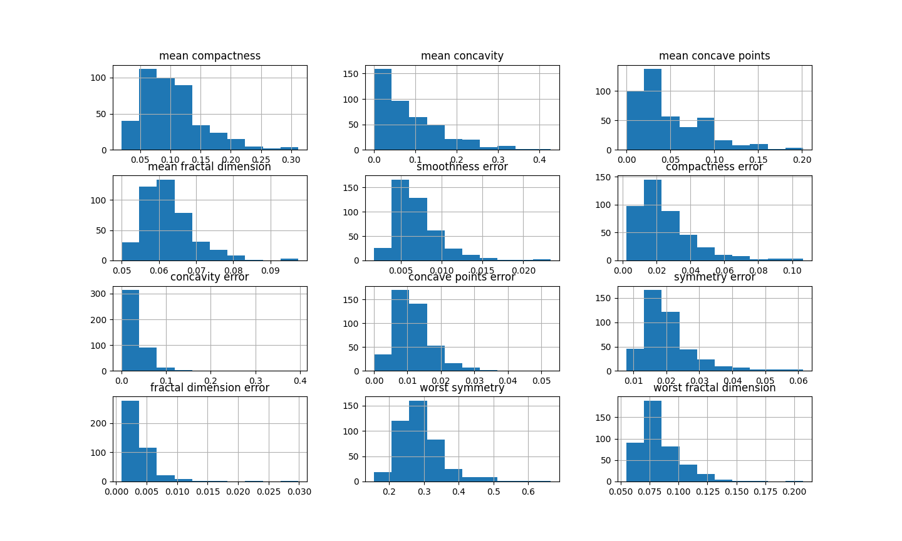
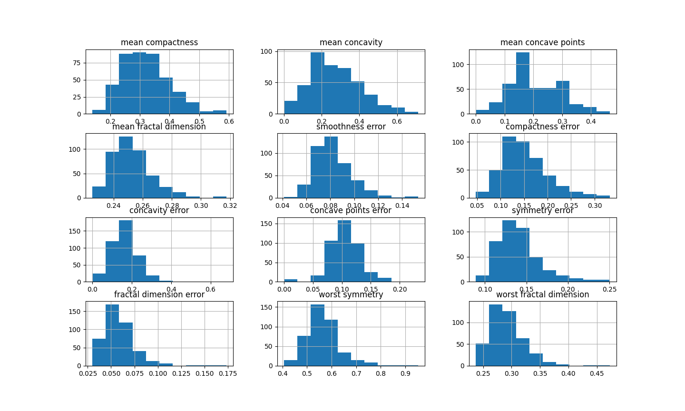

.. _arcsin:

.. currentmodule:: feature_engine.transformation

ArcsinTransformer
=================

The arcsine transformation, also called arcsin square root transformation, or
angular transformation, takes the form of arcsin(sqrt(x)) where x is a real number
between 0 and 1.

.. tip::

    The arcsin square root transformation helps in dealing with probabilities,
    percentages, and proportions.

:class:`ArcsinTransformer()` applies the arcsin transformation to
numerical variables.

.. note::

    :class:`ArcsinTransformer()` only works with numerical variables with values
    between 0 and 1. If the variable contains a value outside of this range, the
    transformer will raise an error.

.. note::

    **New in version 2.0:** When `variables` is `None`, :class:`ArcsinTransformer()` used to
    raise an error if the dataframe contained no numerical variables. You can now
    set the new parameter `return_empty` to `True` to make the transformer return an
    empty list of variables and skip the transformation instead, leaving the dataframe
    unchanged. This lets you reuse the same pipeline across different datasets or
    projects, some of which may not contain numerical variables, without building a
    tailored pipeline for each one. `return_empty` will default to `True` from version
    2.1 onwards.

Python implementation
---------------------

In this section, we'll show how to apply the arcsin square root transformation with
:class:`ArcsinTransformer()`.

Let's load the breast cancer dataset from scikit-learn and separate it into train and
test sets.

.. code:: python

    import pandas as pd
    import matplotlib.pyplot as plt
    from sklearn.model_selection import train_test_split
    from sklearn.datasets import load_breast_cancer

    from feature_engine.transformation import ArcsinTransformer
      
    #Load dataset
    breast_cancer = load_breast_cancer()
    X = pd.DataFrame(breast_cancer.data, columns=breast_cancer.feature_names)
    y = breast_cancer.target

    # Separate data into train and test sets
    X_train, X_test, y_train, y_test = train_test_split(X, y, random_state=0)

We want to apply the arcsin transformation to some of the variables in the
dataframe. These variables' values are in the range 0-1, as we will see in coming
histograms.

First, let's make a list with the variable names:

.. code:: python

    vars_ = [
      'mean compactness',
      'mean concavity',
      'mean concave points',
      'mean fractal dimension',
      'smoothness error',
      'compactness error',
      'concavity error',
      'concave points error',
      'symmetry error',
      'fractal dimension error',
      'worst symmetry',
      'worst fractal dimension']

Now, let's set up the arcsin transformer to modify the previous variables:

.. code:: python

    # set up the arcsin transformer
    tf = ArcsinTransformer(variables = vars_)

    # fit the transformer
    tf.fit(X_train)

.. note::

    The transformer does not learn any parameters when applying the fit method. It does
    check, however, that the variables are numericals and with the correct value range.

We can now go ahead and transform the variables:

.. code:: python

    # transform the data
    train_t = tf.transform(X_train)
    test_t = tf.transform(X_test)

That's it, now the variables have been transformed with the arcsin formula.

Let's go ahead and check out the effect of the transformation on the variables' distribution.
We'll start by making a histogram for each of the original variable:

.. code:: python

    # original variables
    X_train[vars_].hist(figsize=(20,20))

You can see in the following image that the variables are skewed. Note
that all variables have values between 0 and 1:

Now, let's examine the distribution after the transformation:

.. code:: python

    # transformed variable
    train_t[vars_].hist(figsize=(20,20))

In the following image, we see that many of the variables have a more Gaussian looking
shape after the transformation:

Additional resources
--------------------

For tutorials about this and other feature engineering methods check out these resources:

- `Feature Engineering for Machine Learning <https://www.trainindata.com/p/feature-engineering-for-machine-learning>`_, online course.
- `Feature Engineering for Time Series Forecasting <https://www.trainindata.com/p/feature-engineering-for-forecasting>`_, online course.
- `Python Feature Engineering Cookbook <https://www.packtpub.com/en-us/product/python-feature-engineering-cookbook-9781835883587>`_, book.

Both our book and courses are suitable for beginners and more advanced data scientists
alike. By purchasing them you are supporting `Sole <https://linkedin.com/in/soledad-galli>`_,
the main developer of feature-engine.