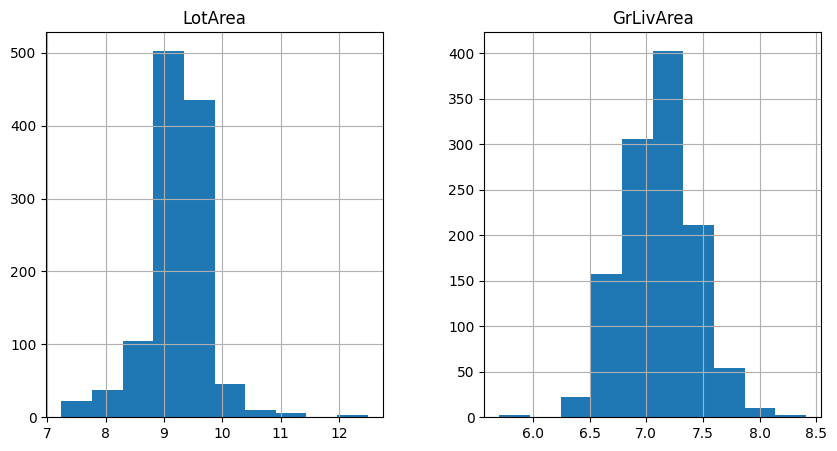

.. _box_cox:

.. currentmodule:: feature_engine.transformation

BoxCoxTransformer
=================

The Box-Cox transformation is a generalization of the power transformations family and is
defined as follows:

.. code:: python

   y = (x**λ - 1) / λ,      for λ != 0
   y = log(x),              for λ = 0

Here, y is the transformed data, x is the variable to transform and λ is the transformation
parameter.

The Box Cox transformation is used to reduce or eliminate variable skewness and obtain
features that better approximate a normal distribution.

The Box Cox transformation evaluates commonly used transformations. When λ = 1 then we
have the original variable, when λ = 0, we have the logarithm transformation, when λ = - 1
we have the reciprocal transformation, and when λ = 0.5 we have the square root.

The Box-Cox transformation evaluates several values of λ using the maximum likelihood,
and selects the optimal value of the λ parameter, which is the one that returns the best
transformation. The best transformation occurs when the transformed data better
approximates a normal distribution.

The Box Cox transformation is defined for strictly positive variables. If your variables
are not strictly positive, you can add a constant or use the Yeo-Johnson transformation
instead.

Uses of the Box Cox Transformation
----------------------------------

Many statistical methods that we use for data analysis make assumptions about the data.
For example, the linear regression model assumes that the values of the dependent variable
are independent, that there is a linear relationship between the response variable and the
independent variables, and that the residuals are normally distributed and centered at 0.

When these assumptions are not met, we can't fully trust the results of our regression
analyses. To make data meet the assumptions and improve the trust in the models, it is
common practice in data science projects to transform the variables before the analysis.

In time series forecasting, we use the Box Cox transformation to make non-stationary time
series stationary.

References
----------

George Box and David Cox. "An Analysis of Transformations". Read at a RESEARCH MEETING,
1964. https://rss.onlinelibrary.wiley.com/doi/abs/10.1111/j.2517-6161.1964.tb00553.x

BoxCoxTransformer
-----------------

The :class:`BoxCoxTransformer()` applies the BoxCox transformation to numerical variables.
It uses `SciPy.stats <https://docs.scipy.org/doc/scipy/reference/generated/scipy.stats.boxcox.html>`_ under the hood to apply the transformation.

The BoxCox transformation works only for strictly positive variables (>=0). If the
variable contains 0 or negative values, the :class:`BoxCoxTransformer()` will return an
error. To apply this transformation to non-positive variables, you can add a constant
value. Alternatively, you can apply the Yeo-Johnson transformation with the
:class:`YeoJohnsonTransformer()`.

Python code examples
--------------------

In this section, we will apply this data transformation to 2 variables of the Ames house
prices dataset.

Let's start by importing the modules, classes and functions and then loading the house
prices dataset and separating it into train and test sets.

.. code:: python

    import matplotlib.pyplot as plt
    from sklearn.datasets import fetch_openml
    from sklearn.model_selection import train_test_split

    from feature_engine.transformation import BoxCoxTransformer

    data = fetch_openml(name='house_prices', as_frame=True)
    data = data.frame

    X = data.drop(['SalePrice', 'Id'], axis=1)
    y = data['SalePrice']

    X_train, X_test, y_train, y_test = train_test_split(
        X, y, test_size=0.2, random_state=42)

    print(X_train.head())

In the following output we see the predictor variables of the house prices dataset:

.. code:: python

          MSSubClass MSZoning  LotFrontage  LotArea Street Alley LotShape  \
    254           20       RL         70.0     8400   Pave   NaN      Reg
    1066          60       RL         59.0     7837   Pave   NaN      IR1
    638           30       RL         67.0     8777   Pave   NaN      Reg
    799           50       RL         60.0     7200   Pave   NaN      Reg
    380           50       RL         50.0     5000   Pave  Pave      Reg

         LandContour Utilities LotConfig  ... ScreenPorch PoolArea PoolQC  Fence  \
    254          Lvl    AllPub    Inside  ...           0        0    NaN    NaN
    1066         Lvl    AllPub    Inside  ...           0        0    NaN    NaN
    638          Lvl    AllPub    Inside  ...           0        0    NaN  MnPrv
    799          Lvl    AllPub    Corner  ...           0        0    NaN  MnPrv
    380          Lvl    AllPub    Inside  ...           0        0    NaN    NaN

         MiscFeature MiscVal  MoSold  YrSold  SaleType  SaleCondition
    254          NaN       0       6    2010        WD         Normal
    1066         NaN       0       5    2009        WD         Normal
    638          NaN       0       5    2008        WD         Normal
    799          NaN       0       6    2007        WD         Normal
    380          NaN       0       5    2010        WD         Normal

    [5 rows x 79 columns]

Let's inspect the distribution of 2 variables in the original data with histograms.

.. code:: python

    X_train[['LotArea', 'GrLivArea']].hist(figsize=(10,5))
    plt.show()

In the following plots we see that the variables are non-normally distributed:

.. image:: ../../images/nonnormalvars2.png

Now we apply the BoxCox transformation to the 2 indicated variables. First, we set up
the transformer and fit it to the train set, so that it finds the optimal lambda value.

.. code:: python

    boxcox = BoxCoxTransformer(variables = ['LotArea', 'GrLivArea'])
    boxcox.fit(X_train)

With `fit()`, the :class:`BoxCoxTransformer()` learns the optimal lambda for the
transformation. We can inspect these values as follows:

.. code:: python

    boxcox.lambda_dict_

We see the optimal lambda values below:

.. code:: python

    {'LotArea': 0.0028222323212918547, 'GrLivArea': -0.006312580181375803}

Now, we can go ahead and transform the data:

.. code:: python

   train_t = boxcox.transform(X_train)
   test_t = boxcox.transform(X_test)

Let's now examine the variable distribution after the transformation with histograms:

.. code:: python

    train_t[['LotArea', 'GrLivArea']].hist(figsize=(10,5))
    plt.show()

In the following histograms we see that the variables approximate better the normal distribution.

If we want to recover the original data representation, we can also do so as follows:

.. code:: python

    train_unt = boxcox.inverse_transform(train_t)
    test_unt = boxcox.inverse_transform(test_t)

    train_unt[['LotArea', 'GrLivArea']].hist(figsize=(10,5))
    plt.show()

In the following plots we see that the variables are non-normally distributed, because they contain the original values, prior to the data transformation:

.. image:: ../../images/nonnormalvars2.png

Tutorials, books and courses
----------------------------

You can find more details about the Box Cox transformation technique with the :class:`BoxCoxTransformer()` here:

- `Jupyter notebook <https://nbviewer.org/github/feature-engine/feature-engine-examples/blob/main/transformation/BoxCoxTransformer.ipynb>`_

For tutorials about this and other data transformation techniques and feature engineering
methods check out our online courses:

.. figure::  ../../images/feml.png
   :width: 300
   :figclass: align-center
   :align: left
   :target: https://www.trainindata.com/p/feature-engineering-for-machine-learning

   Feature Engineering for Machine Learning

.. figure::  ../../images/fetsf.png
   :width: 300
   :figclass: align-center
   :align: right
   :target: https://www.trainindata.com/p/feature-engineering-for-forecasting

   Feature Engineering for Time Series Forecasting

|
|
|
|
|
|
|
|
|
|

Or read our book:

.. figure::  ../../images/cookbook.png
   :width: 200
   :figclass: align-center
   :align: left
   :target: https://www.packtpub.com/en-us/product/python-feature-engineering-cookbook-9781835883587

   Python Feature Engineering Cookbook

|
|
|
|
|
|
|
|
|
|
|
|
|

Our book and courses are suitable for beginners and more advanced data scientists
alike. By purchasing them you are supporting Sole, the main developer of Feature-engine.