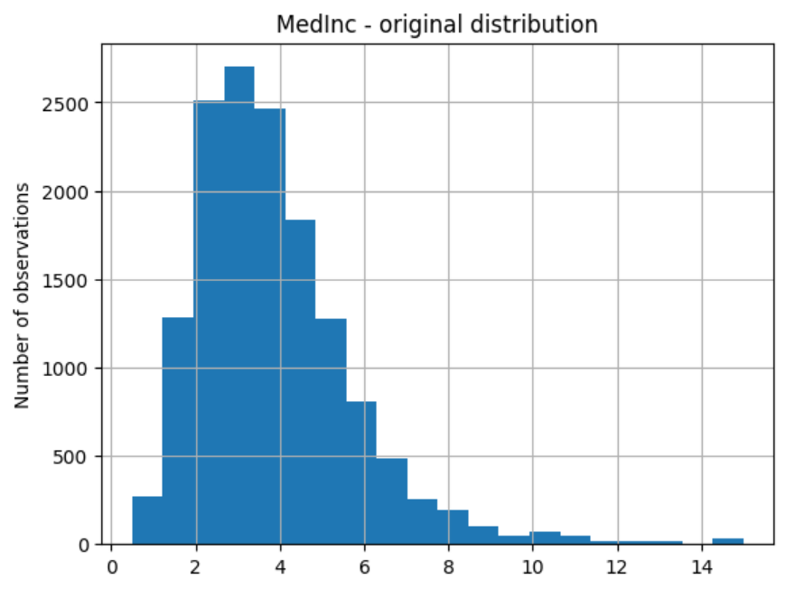

.. _log_cp:

.. currentmodule:: feature_engine.transformation

LogCpTransformer
================

:class:`LogCpTransformer()` applies the transformation log(x + C), where x is the
variable to transform and C is a positive constant that shifts the distribution towards
positive values.

:class:`LogCpTransformer()` is an extension of :class:`LogTransformer()` that allows
adding a constant to move distributions towards positive values. For more details about
the logarithm transformation, check out the :ref:`LogTransformer()'s user Guide <log_transformer>`.

Defining C
----------

You can enter the positive quantity to add to the variable as a dictionary, where the
keys are the variable names, and the values are the constant to add to each variable. If you
want to add the same value to all variables, you can pass an integer or float, instead.

Alternatively, the :class:`LogCpTransformer()` will find the necessary value to make all
values of the variable positive. For strictly positive variables, C will be 0, and the
transformation will be log(x).

Python example
--------------

Let's check out the functionality of :class:`LogCpTransformer()`.

Transforming strictly positive variables
~~~~~~~~~~~~~~~~~~~~~~~~~~~~~~~~~~~~~~~~

Let's load the California housing dataset that comes with Scikit-learn and separate it
into train and test sets.

.. code:: python

    import pandas as pd
    import matplotlib.pyplot as plt
    from sklearn.model_selection import train_test_split
    from sklearn.datasets import fetch_california_housing

    from feature_engine.transformation import LogCpTransformer

    # Load dataset
    X, y = fetch_california_housing( return_X_y=True, as_frame=True)

    # Separate into train and test sets
    X_train, X_test, y_train, y_test =  train_test_split(
        X, y, test_size=0.3, random_state=0)

Now we want to apply the logarithm to 2 of the variables in the dataset using the
:class:`LogCpTransformer()`. We want the transformer to detect automatically the
quantity "C" that needs to be added to the variable:

.. code:: python

    # set up the variable transformer
    tf = LogCpTransformer(variables = ["MedInc", "HouseAge"], C="auto")

    # fit the transformer
    tf.fit(X_train)

With `fit()` the :class:`LogCpTransformer()` learns the quantity "C" and stores it as
an attribute. We can visualise the learned parameters as follows:

.. code:: python

    # learned constant C
    tf.C_

As these variables are strictly positive, the transformer will add 0 to the variables
before applying the logarithm transformation:

.. code:: python

    {'MedInc': 0, 'HouseAge': 0}

In this case, the transformation applied by :class:`LogCpTransformer()` is the same as
using :class:`LogTransformer()` because these variables are strictly positive.

We can now go ahead and transform the variables:

.. code:: python

    # transform the data
    train_t= tf.transform(X_train)
    test_t= tf.transform(X_test)

Then we can plot the original variable distribution:

.. code:: python

    # un-transformed variable
    X_train["MedInc"].hist(bins=20)
    plt.title("MedInc - original distribution")
    plt.ylabel("Number of observations")

|

And the distribution of the transformed variable:

.. code:: python

    # transformed variable
    train_t["MedInc"].hist(bins=20)
    plt.title("MedInc - transformed distribution")
    plt.ylabel("Number of observations")

.. image:: ../../images/logcptransform.png

|

Transforming non-strictly positive variables
~~~~~~~~~~~~~~~~~~~~~~~~~~~~~~~~~~~~~~~~~~~~

Let's now show the functionality of :class:`LogCpTransformer()` with variables that contain
values lower or equal to 0. Let's load the diabetes dataset:

.. code:: python

    import pandas as pd
    import matplotlib.pyplot as plt
    from sklearn.model_selection import train_test_split
    from sklearn.datasets import load_diabetes
    from feature_engine.transformation import LogCpTransformer

    # Load dataset
    X, y = load_diabetes( return_X_y=True, as_frame=True)

    # Separate into train and test sets
    X_train, X_test, y_train, y_test =  train_test_split(
        X, y, test_size=0.3, random_state=0)

Let's print out a summary of the main characteristics of 2 of the variables:

.. code:: python

    print(X_train[["bmi", "s3"]].describe())

In the following output we see that the variables contain negative values:

.. code:: python

                  bmi          s3
    count  309.000000  309.000000
    mean    -0.001298    0.000511
    std      0.048368    0.048294
    min     -0.084886   -0.102307
    25%     -0.036385   -0.032356
    50%     -0.008362   -0.006584
    75%      0.030440    0.030232
    max      0.170555    0.181179

Let's now set up :class:`LogCpTransformer()` to shift the variables' distribution to
positive values and then apply the logarithm:

.. code:: python

    tf = LogCpTransformer(variables = ["bmi", "s3"], C="auto")
    tf.fit(X_train)

We can inspect the constant values that will be added to each variable:

.. code:: python

    tf.C_

Since these variables were not strictly positive, :class:`LogCpTransformer()` found
the minimum value needed to make their values positive:

.. code:: python

    {'bmi': 1.0848862355291056, 's3': 1.102307050517416}

We can now transform the data:

.. code:: python

    train_t= tf.transform(X_train)
    test_t= tf.transform(X_test)

Let's plot `bmi` before the transformation:

.. code:: python

    X_train["bmi"].hist(bins=20)
    plt.title("bmi - original distribution")
    plt.ylabel("Number of observations")

In the following image we see the original distribution of `bmi`:

.. image:: ../../images/bmiraw.png

|

Let's now plot the transformed variable:

.. code:: python

    # transformed variable
    train_t["bmi"].hist(bins=20)
    plt.title("bmi - transformed distribution")
    plt.ylabel("Number of observations")

In the following image we see the distribution of `bmi` after the transformation:

.. image:: ../../images/bmilogcp.png

|

Adding the same constant to all variables
~~~~~~~~~~~~~~~~~~~~~~~~~~~~~~~~~~~~~~~~~

You can add the same constant to all variables by setting up :class:`LogCpTransformer()`
as follows:

.. code:: python

    tf = LogCpTransformer(C=5)
    tf.fit(X_train)

In this case, all numerical variables will be transformed. We can find the variables that
will be transformed in the `variables_` attribute:

.. code:: python

    tf.variables_

All numerical variables were selected for the transformation:

.. code:: python

    ['age', 'sex', 'bmi', 'bp', 's1', 's2', 's3', 's4', 's5', 's6']

You can now apply `transform()` to transform all these variables.

Adding different user defined constants
~~~~~~~~~~~~~~~~~~~~~~~~~~~~~~~~~~~~~~~

If you want to add specific values to specific variables, you can do so by setting
:class:`LogCpTransformer()` as follows:

.. code:: python

    tf = LogCpTransformer(C={"bmi": 2, "s3": 3, "s4": 4})
    tf.fit(X_train)

In this case, :class:`LogCpTransformer()` will only modify the variables indicated in the
dictionary:

.. code:: python

    tf.variables_

The variables in the dictionary will be transformed:

.. code:: python

    ['bmi', 's3', 's4']

And the constant values will be those from the dictionary:

.. code:: python

    tf.C_

`C_` coincides with the values entered in `C`:

.. code:: python

    {'bmi': 2, 's3': 3, 's4': 4}

You can now apply `transform()` to transform all these variables.

Tutorials, books and courses
----------------------------

You can find more details about the :class:`LogCpTransformer()` here:

- `Jupyter notebook <https://nbviewer.org/github/feature-engine/feature-engine-examples/blob/main/transformation/LogCpTransformer.ipynb>`_

For tutorials about this and other data transformation methods, like the square root transformation, power transformations, the box cox transformation, check out our online course:

.. figure::  ../../images/feml.png
   :width: 300
   :figclass: align-center
   :align: left
   :target: https://www.trainindata.com/p/feature-engineering-for-machine-learning

   Feature Engineering for Machine Learning

|
|
|
|
|
|
|
|
|
|

Or read our book:

.. figure::  ../../images/cookbook.png
   :width: 200
   :figclass: align-center
   :align: left
   :target: https://www.packtpub.com/en-us/product/python-feature-engineering-cookbook-9781835883587

   Python Feature Engineering Cookbook

|
|
|
|
|
|
|
|
|
|
|
|
|

Both our book and course are suitable for beginners and more advanced data scientists
alike.