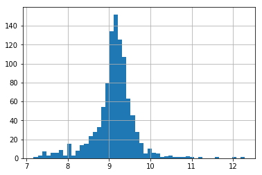

.. _log_transformer:

.. currentmodule:: feature_engine.transformation

LogTransformer
==============

The :class:`LogTransformer()` will apply the logarithm to the indicated variables. Note
that the logarithm can only be applied to positive values. Thus, if the variable contains
0 or negative variables, this transformer will return and error.

**Example**

Let's load the house prices dataset and  separate it into train and test sets (more
details about the dataset :ref:`here <datasets>`).

.. code:: python

	import numpy as np
	import pandas as pd
	import matplotlib.pyplot as plt
	from sklearn.model_selection import train_test_split

	from feature_engine import transformation as vt

	# Load dataset
	data = pd.read_csv('houseprice.csv')

	# Separate into train and test sets
	X_train, X_test, y_train, y_test =  train_test_split(
		    data.drop(['Id', 'SalePrice'], axis=1),
		    data['SalePrice'], test_size=0.3, random_state=0)

Now we want to apply the logarithm to 2 of the variables in the dataset using the
:class:`LogTransformer()`.

.. code:: python

	# set up the variable transformer
	tf = vt.LogTransformer(variables = ['LotArea', 'GrLivArea'])

	# fit the transformer
	tf.fit(X_train)

With `fit()`, this transformer does not learn any parameters. We can go ahead not an
transform the variables.

.. code:: python

	# transform the data
	train_t= tf.transform(X_train)
	test_t= tf.transform(X_test)

Next, we make a histogram of the original variable distribution:

.. code:: python

	# un-transformed variable
	X_train['LotArea'].hist(bins=50)

.. image:: ../../images/lotarearaw.png

And now, we can explore the distribution of the variable after the logarithm transformation:

.. code:: python

	# transformed variable
	train_t['LotArea'].hist(bins=50)

Note that the transformed variable has a more Gaussian looking distribution.

More details
^^^^^^^^^^^^

You can find more details about the :class:`LogTransformer()` here:

- `Jupyter notebook <https://nbviewer.org/github/feature-engine/feature-engine-examples/blob/main/transformation/LogTransformer.ipynb>`_

For more details about this and other feature engineering methods check out these resources:

- `Feature engineering for machine learning <https://www.trainindata.com/p/feature-engineering-for-machine-learning>`_, online course.
- `Python Feature Engineering Cookbook <https://www.amazon.com/Python-Feature-Engineering-Cookbook-transforming-dp-1804611301/dp/1804611301>`_, book.
