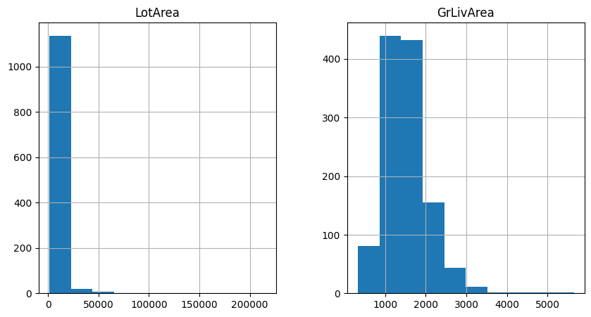
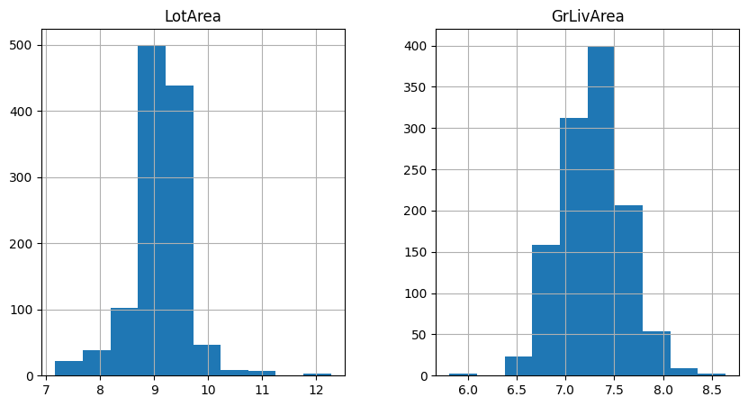

.. _log_transformer:

.. currentmodule:: feature_engine.transformation

LogTransformer
==============

The log transformation is used to transform skewed data so that the values are more evenly distributed across the value range.

Some regression models, like linear regression, t-test and ANOVA, make assumptions about the data. When the assumptions are not met, we can't trust the results. Applying data transformations is common practice during regression analysis because it can help make the data meet those assumptions and hence obtain more reliable results.

The logarithm function is helpful for dealing with positive data with a right-skewed distribution. That is, those variables whose observations accumulate towards lower values. A common example is the variable income, with a heavy accumulation of values toward lower salaries.

More generally, when data follows a log-normal distribution, then its log-transformed version approximates a normal distribution.

Other useful transformations are the square root transformation, power transformations and the box cox transformation.

In statistical analysis, we can apply the logarithmic transformation to both the dependent variable (that is, the target) and the independent variables (that is, the predictors). These can help meet the linear regression model assumptions and unmask a linear relationship between predictors and response variable.

With Feature-engine, we can only log transform input features. You can easily transform the target variable by applying `np.log(y)`.

The LogTransformer
------------------

The :class:`LogTransformer()` applies the natural logarithm or the logarithm in base 10 to numerical variables. Note that the logarithm can only be applied to positive values. Thus, if the variable contains 0 or negative variables, this transformer will return and error.

To transform non-positive variables you can add a constant to shift the data points towards positive values. You can do this from within the transformer by using :class:`LogCpTransformer()`.

Python implementation
---------------------

In this section, we will apply the logarithmic transformation to some independent variables from the Ames house prices dataset.

Let's start by importing the required libraries and transformers for data analysis and then load the dataset and separate it into train and test sets.

.. code:: python

    import matplotlib.pyplot as plt
    from sklearn.datasets import fetch_openml
    from sklearn.model_selection import train_test_split

    from feature_engine.transformation import LogTransformer

    data = fetch_openml(name='house_prices', as_frame=True)
    data = data.frame

    X = data.drop(['SalePrice', 'Id'], axis=1)
    y = data['SalePrice']

    X_train, X_test, y_train, y_test = train_test_split(
        X, y, test_size=0.2, random_state=42)

    print(X_train.head())

In the following output we see the predictor variables of the house prices dataset:

.. code:: python

          MSSubClass MSZoning  LotFrontage  LotArea Street Alley LotShape  \
    254           20       RL         70.0     8400   Pave   NaN      Reg
    1066          60       RL         59.0     7837   Pave   NaN      IR1
    638           30       RL         67.0     8777   Pave   NaN      Reg
    799           50       RL         60.0     7200   Pave   NaN      Reg
    380           50       RL         50.0     5000   Pave  Pave      Reg

         LandContour Utilities LotConfig  ... ScreenPorch PoolArea PoolQC  Fence  \
    254          Lvl    AllPub    Inside  ...           0        0    NaN    NaN
    1066         Lvl    AllPub    Inside  ...           0        0    NaN    NaN
    638          Lvl    AllPub    Inside  ...           0        0    NaN  MnPrv
    799          Lvl    AllPub    Corner  ...           0        0    NaN  MnPrv
    380          Lvl    AllPub    Inside  ...           0        0    NaN    NaN

         MiscFeature MiscVal  MoSold  YrSold  SaleType  SaleCondition
    254          NaN       0       6    2010        WD         Normal
    1066         NaN       0       5    2009        WD         Normal
    638          NaN       0       5    2008        WD         Normal
    799          NaN       0       6    2007        WD         Normal
    380          NaN       0       5    2010        WD         Normal

    [5 rows x 79 columns]

Let's inspect the distribution of 2 variables from the original data with histograms.

.. code:: python

    X_train[['LotArea', 'GrLivArea']].hist(figsize=(10,5))
    plt.show()

In the following plots we see that the variables show a right-skewed distribution, so they are good candidates for the log transformation:

We want to apply the natural logarithm to these 2 variables in the dataset using the
:class:`LogTransformer()`. We set up the transformer as follows:

.. code:: python

    logt = LogTransformer(variables = ['LotArea', 'GrLivArea'])

    logt.fit(X_train)

With `fit()`, this transformer does not learn any parameters, but it checks that the variables you entered are numerical, or if no variable was entered, it will automatically find all numerical variables.

To apply the logarithm in base 10, pass `'10'` to the `base` parameter when setting up the transformer.

Now, we can go ahead and transform the data:

.. code:: python

   train_t = logt.transform(X_train)
   test_t = logt.transform(X_test)

Let's now examine the variable distribution in the log-transformed data with histograms:

.. code:: python

    train_t[['LotArea', 'GrLivArea']].hist(figsize=(10,5))
    plt.show()

In the following histograms we see that the natural log transformation helped make the variables better approximate a normal distribution.

Note that the transformed variable has a more Gaussian looking distribution.

If we want to recover the original data representation, with the method `inverse_transform`, the :class:`LogTransformer()` will apply the exponential function to obtain the variable in its original scale:

.. code:: python

    train_unt = logt.inverse_transform(train_t)
    test_unt = logt.inverse_transform(test_t)

    train_unt[['LotArea', 'GrLivArea']].hist(figsize=(10,5))
    plt.show()

In the following plots we see histograms showing the variables in their original scale:

Following the transformations with scatter plots and residual analysis of the regression models helps understand if the transformations are useful in our regression analysis.

Tutorials, books and courses
----------------------------

You can find more details about the :class:`LogTransformer()` here:

- `Jupyter notebook <https://nbviewer.org/github/feature-engine/feature-engine-examples/blob/main/transformation/LogTransformer.ipynb>`_

For tutorials about this and other data transformation methods, like the square root transformation, power transformations, the box cox transformation, check out our online course:

.. figure::  ../../images/feml.png
   :width: 300
   :figclass: align-center
   :align: left
   :target: https://www.trainindata.com/p/feature-engineering-for-machine-learning

   Feature Engineering for Machine Learning

|
|
|
|
|
|
|
|
|
|

Or read our book:

.. figure::  ../../images/cookbook.png
   :width: 200
   :figclass: align-center
   :align: left
   :target: https://www.packtpub.com/en-us/product/python-feature-engineering-cookbook-9781835883587

   Python Feature Engineering Cookbook

|
|
|
|
|
|
|
|
|
|
|
|
|

Both our book and course are suitable for beginners and more advanced data scientists
alike. By purchasing them you are supporting Sole, the main developer of Feature-engine.