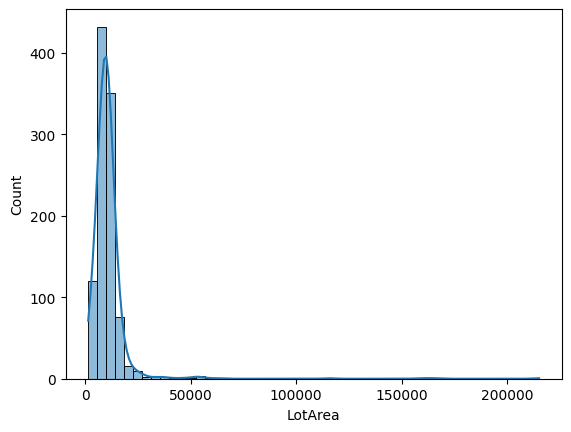
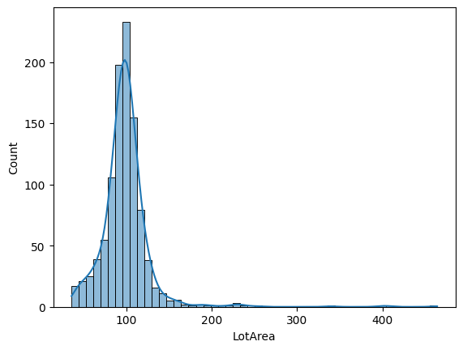
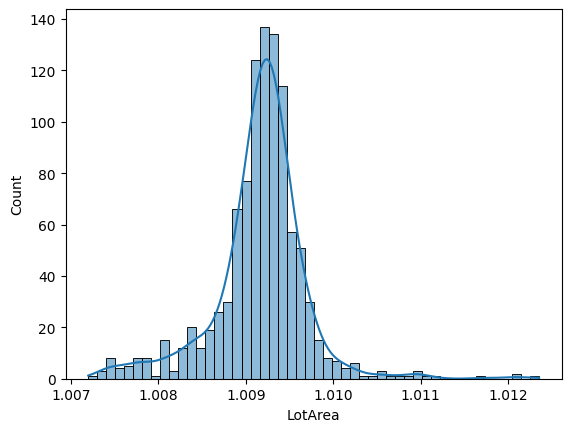
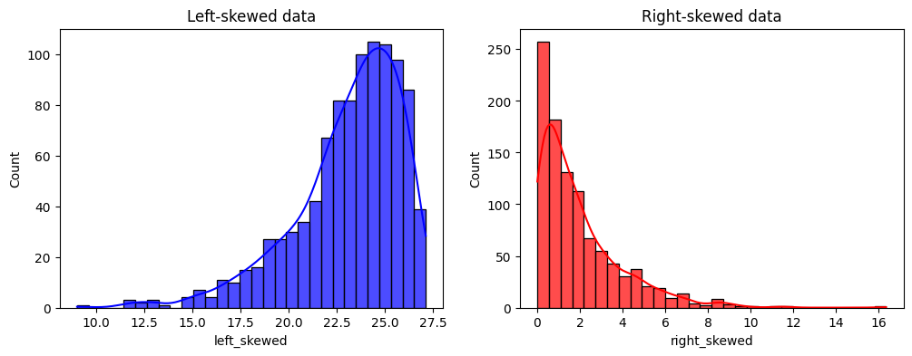
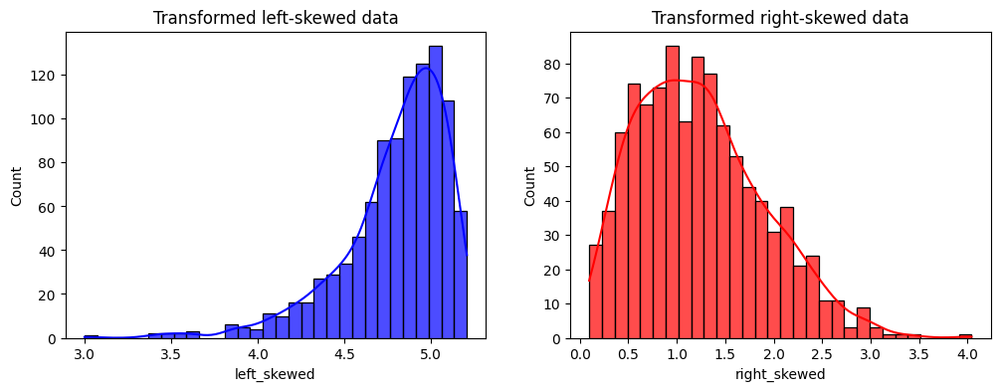
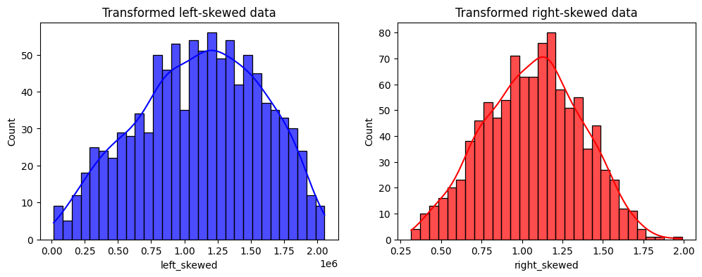

.. _power:

.. currentmodule:: feature_engine.transformation

PowerTransformer
================

Power transformations are a family of mathematical functions used to transform numerical
variables into a more suitable shape for modeling. The transformation function is 
typically represented as :math:`x' = x^{\lambda}`, where :math:`x` is the original 
variable and :math:`\lambda` (lambda) is the transformation parameter.

These transformations help stabilize the variance, make the data adopt a more normal 
distribution-like shape, and/or improve the linearity of relationships.

Use of Power transformations
----------------------------

Power transformations are particularly useful for meeting the assumptions of 
statistical tests, and models that require linear relationships between variables and 
homoscedasticity (constant variance across values). They can also help in reducing 
skewness in the data, i.e., by normalizing distributions.

Power transformations differ from scalers in that they modify the distribution of the 
data, typically to stabilize variance and normalize the distribution, whereas scalers 
simply adjust the scale of the data without altering its underlying distribution.

In short, power functions provide an excellent data analysis toolkit, especially for 
linear models (regression or classification).

Special cases of power transformations
--------------------------------------

Most variable transformations, like the logarithm, the reciprocal and the square root, 
are special cases of power transformations, where the exponent (lambda) is 
0, -1 and 0.5, respectively.

You can apply these transformations with :class:`PowerTransformer`, as we will see 
later in this page, or through dedicated transformers, like :class:`LogTransformer` 
and :class:`ReciprocalTransformer`.

Which lambda should I choose?
~~~~~~~~~~~~~~~~~~~~~~~~~~~~~

The challenge of power transformations resides in finding the right lambda for the 
transformation. In general, this consists of trial and error, or using generalization 
functions like the Box-Cox or the Yeo-Johnson transformation.

As general guidelines, if the variables are right-skewed we'd use lambda <1, and if the 
variables are left-skewed we'd use lambda >1.

Box-Cox transformation
~~~~~~~~~~~~~~~~~~~~~~

The Box-Cox transformation is a generalization of power transformations that finds 
an optimal lambda to stabilize variance and make the data more normally distributed. 
This transformation only accepts positive values.

Feature-engine's :class:`BoxCoxTransformer()` applies the Box-Cox transformation.

Yeo-Johnson transformation
~~~~~~~~~~~~~~~~~~~~~~~~~~

The Yeo-Johnson transformation extends the Box-Cox transformation to handle both 
positive and negative values, to find an optimal lambda for the transformation.

:class:`YeoJohnsonTransformer()` applies the Yeo-Johnson transformation.

Other transformers
~~~~~~~~~~~~~~~~~~

Feature-engine also provides the following power transformers:

- :class:`LogTransformer`
- :class:`LogCpTransformer`
- :class:`ReciprocalTransformer`
- :class:`ArcsinTransformer`

For more details about these variance stabilizing transformations, check the article 
`Variance stabilizing transformations in machine learning <https://www.blog
.trainindata.com/variance-stabilizing-transformations-in-machine-learning/>`_.

Python example
--------------

:class:`PowerTransformer()` applies power transformations to numerical independent 
variables. We'll use the Ames House Prices' dataset to see it in action. 
First, let's load the dataset and split it into train and test sets:

.. code:: python

	import numpy as np
	import pandas as pd
	import seaborn as sns
	import matplotlib.pyplot as plt
	from sklearn.preprocessing import scale
	from sklearn.datasets import fetch_openml
	from sklearn.model_selection import train_test_split

	from feature_engine.transformation import PowerTransformer

	# Load dataset
	X, y = fetch_openml(name='house_prices', version=1, return_X_y=True, as_frame=True)
	X.set_index('Id', inplace=True)

	# Separate into train and test sets
	X_train, X_test, y_train, y_test =  train_test_split(
		X, y, test_size=0.3, random_state=42
	)

Now, let's visualize the distribution of the `LotArea` variable:

.. code:: python

	sns.histplot(X_train['LotArea'], kde=True, bins=50)

In the following output, we can see that the original feature distribution is highly
right-skewed:

|

Finding the right lambda for the power transformation is challenging, 
and it often requires trial an error. So let's begin by trying the default 
coefficient (lambda), which is 0.5 (i.e., we're applying a square root transformation):

.. code:: python

	# Set up the variable transformer (tf)
	tf = PowerTransformer(variables = ['LotArea', 'GrLivArea'])

	# Fit the transformer
	X_train_transformed = tf.fit_transform(X_train)

	# Plot histogram
	sns.histplot(X_train_transformed['LotArea'], kde=True, bins=50)

And here's the transformed feature distribution:

|

It looks better, huh!? It's still right-skewed, but the variation is lower
(let's confirm it soon).
Now, let's try to pass an "optimal value" for the parameter λ (exp):

.. code:: python

	# Set up the variable transformer (tf)
	tf_custom = PowerTransformer(variables = ['LotArea', 'GrLivArea'], exp=0.001)

	# Fit the transformer
	X_train_transformed_custom = tf_custom.fit_transform(X_train)

	# Plot histogram
	sns.histplot(X_train_transformed_custom['LotArea'], kde=True, bins=50)

In the following output, we can see the data now has a more Gaussian-like distribution,
and the variance seems lower. Therefore, we can see that by using a custom lambda
we can transform the variable's distribution:

|

Power transformations are expected to reshape the data distribution, reducing the 
impact of extreme outliers and, therefore, lowering the variance.

Since the power transformation changes the scale of the data, we cannot directly 
compare the variance. Instead, we'll compute the coefficient of variation (CV). 
The CV for a sample is defined as the ratio of the standard deviation to the mean, 
and it's expressed as :math:`CV = \left(\frac{s}{\overline{x}}\right)`.

Let's now use the CV to assess the impact of the data transformations on the variance.

.. code:: python

	# Compute coefficient of variation (CV)

	def compute_cv(data):
		"""Compute the coefficient of variation (CV) for a given dataset."""
		return np.std(data, ddof=1) / np.mean(data) if np.mean(data) != 0 else np.inf

	cv_raw_data = compute_cv(X_train['LotArea'])
	cv_transformed_data = compute_cv(X_train_transformed['LotArea'])
	cv_transformed_data_custom = compute_cv(X_train_transformed_custom['LotArea'])

	print(f"""
	Raw data CV: {cv_raw_data:.2%}
	Transformed data exp:0.5 CV: {cv_transformed_data:.2%}
	Transformed data exp:0.001 CV (custom): {cv_transformed_data_custom:.2%}
	""")

In the following output, we can see the resulting CV for both 
original and transformed data:

.. code:: text

	Raw data CV: 105.44%
	Transformed data exp:0.5 CV: 30.91%
	Transformed data exp:0.001 CV (custom): 0.05%

By comparing the coefficient of variation (CV) for the raw and transformed data, 
the effectiveness of the transformation is noticeable. The CV for the original CV is 
higher than 1 (100%), which means that the variance is higher than the mean 
(due to the highly skewed data). The transformation with the squared root 
transformation (default exp parameter) resulted in a CV of approximately 31%. 
Finally, a power transformation with a lower exp parameter value resulted in 0.05% CV, 
drastically lower than the original and square-root transformed data.

It's worth noting that despite exhibiting a low coefficient of variation (CV), 
which measures variability relative to the mean, a feature can retain enough absolute 
variance to effectively contribute to the performance of machine learning models, 
especially in algorithms that hinge on the assumption of data variability, 
like linear regression and other regression-based models.

Choosing lambda accordingly to the distribution
~~~~~~~~~~~~~~~~~~~~~~~~~~~~~~~~~~~~~~~~~~~~~~~

In this section, we'll further explore the impact of the lambda parameter for 
left- and right-skewed distributions.

First, let's create a toy dataset with these distributions:

.. code:: python

	# Set random seed for reproducibility
	np.random.seed(42)

	# Generating right-skewed data using exponential distribution
	right_skewed_data = np.random.exponential(scale=2, size=1000)

	# Generating left-skewed data by flipping the right-skewed data
	left_skewed_data = -np.random.gamma(shape=2, scale=2, size=1000) \
		+ np.max(np.random.gamma(shape=2, scale=2, size=1000))

	# Create dataframe with simulated data
	df_sim = pd.DataFrame({
		'left_skewed': left_skewed_data,
		'right_skewed': right_skewed_data}
	)

	# Plotting the distributions
	fig, axes = plt.subplots(ncols=2, figsize=(12, 4))

	hist_params = dict(kde=True, bins=30, alpha=0.7)
	sns.histplot(df_sim.left_skewed, ax=axes[0], color='blue', **hist_params)
	sns.histplot(df_sim.right_skewed, ax=axes[1], color='red', **hist_params)

	axes[0].set_title('Left-skewed data')
	axes[1].set_title('Right-skewed data')

	plt.show()

We see the distributions of the variables we created in the following output:

Now, let's transform the data using :class:`PowerTransformer()` 
with the default lambda parameter (exp = 0.5):

.. code:: python

	# Set up the variable transformer (tf)
	tf = PowerTransformer(variables = ['left_skewed', 'right_skewed'])

	# Fit the transformer
	df_sim_transformed = tf.fit_transform(df_sim)

	# Plot histograms
	fig,axes = plt.subplots(ncols=2, figsize=(12,4))

	sns.histplot(
		df_sim_transformed['left_skewed'], ax=axes[0], color='blue', **hist_params
	)
	sns.histplot(
		df_sim_transformed['right_skewed'], ax=axes[1], color='red', **hist_params
	)

	axes[0].set_title('Transformed left-skewed data')
	axes[1].set_title('Transformed right-skewed data')

	plt.show()

In the following output we can see the distributions for each transformed variable:

It improved the distribution, but we can do way better!

As per the guidelines we mentioned earlier, we'll use a lambda <1 for the 
right-skew distribution and a lambda >1 for the left-skew distribution:

.. code:: python

	# Set up the variable transformer (tf)
	tf_right = PowerTransformer(variables = ['right_skewed'], exp=0.246)
	tf_left = PowerTransformer(variables = ['left_skewed'], exp=4.404)

	# Fit the transformers
	tf_right.fit(df_sim)
	tf_left.fit(df_sim)

	# Plot histograms
	fig,axes = plt.subplots(ncols=2, figsize=(12,4))

	sns.histplot(
		tf_left.transform(df_sim)['left_skewed'], ax=axes[0],
		color='blue', **hist_params
	)
	sns.histplot(
		tf_right.transform(df_sim)['right_skewed'], ax=axes[1],
		color='red', **hist_params
	)

	axes[0].set_title('Transformed left-skewed data')
	axes[1].set_title('Transformed right-skewed data')

	plt.show()

In the following output we see the distribution of the transformed variables:

Now, the distribution looks more like a Gaussian one :)

Inverse transformation
~~~~~~~~~~~~~~~~~~~~~~

Feature-engine power transformers can reverse the transformation to obtain 
the original data representation. So for example, if we apply the square root 
transformation, the transformer can square the transformed data to obtain the 
original variable. This is useful to interpret the results of the machine learning 
models and present the results of the data analysis.

In this section, we will examine how to use inverse transformations.

First, let's fit the transformer once again:

.. code:: python

	# Set up the variable transformer (tf)
	tf = PowerTransformer(variables = ['left_skewed', 'right_skewed'])

	# Fit the transformer
	df_sim_transformed = tf.fit_transform(df_sim)

Now, let's see the first rows of the original data:

.. code:: python

	df_sim.head(3)

In the following output we see the first rows of the original data:

.. code:: text

		left_skewed	right_skewed
	0	23.406936	0.938536
	1	26.282836	6.020243
	2	22.222784	2.633491

Let's see the first rows of the transformed data:

.. code:: python

	df_sim_transformed.head(3)

In the following output we see the first rows of the transformed data:

.. code:: text

		left_skewed	right_skewed
	0	4.838072	0.968781
	1	5.126679	2.453618
	2	4.714105	1.622804

Finally, let's see how we can reverse the transformation to obtain the original values:

.. code:: python

	tf.inverse_transform(df_sim_transformed).head(3)

Result of the inverse transformation:

.. code:: text

		left_skewed	right_skewed
	0	23.406936	0.938536
	1	26.282836	6.020243
	2	22.222784	2.633491

As we can see, the original data and the inverse transformed one are identical.

Considerations
--------------

Power transformations are a powerful tool to transform data to meet the assumptions 
of statistical tests and linear regression models.

In practice, we'd use the :class:`BoxCoxTransformer()` or 
:class:`YeoJohnsonTransformer()`, because they automatically find the best lambda 
for the transformation. But automation is not always better. 
Often the transformations do not return the desired output.

We should always follow up with an analysis of transformations, comparing the original 
and transformed distributions, to ensure that we obtain the results we expect.

Additional resources
--------------------

You can find more details about the :class:`PowerTransformer()` here:

- `Jupyter notebook <https://nbviewer.org/github/feature-engine/feature-engine-examples/blob/main/transformation/PowerTransformer.ipynb>`_

For more details about this and other feature engineering methods
check out these resources:

.. figure::  ../../images/feml.png
   :width: 300
   :figclass: align-center
   :align: left
   :target: https://www.trainindata.com/p/feature-engineering-for-machine-learning

   Feature Engineering for Machine Learning

|
|
|
|
|
|
|
|
|
|

Or read our book:

.. figure::  ../../images/cookbook.png
   :width: 200
   :figclass: align-center
   :align: left
   :target: https://www.packtpub.com/en-us/product/python-feature-engineering-cookbook-9781835883587

   Python Feature Engineering Cookbook

|
|
|
|
|
|
|
|
|
|
|
|
|

Both our book and course are suitable for beginners and more advanced data scientists
alike. By purchasing them you are supporting Sole, the main developer of Feature-engine.