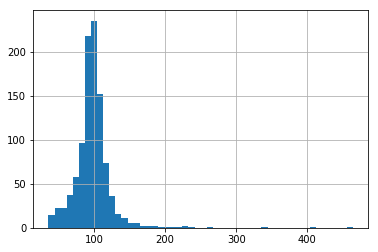

PowerTransformer
================

.. code:: python

	import numpy as np
	import pandas as pd
	import matplotlib.pyplot as plt
	from sklearn.model_selection import train_test_split

	from feature_engine import transformation as vt

	# Load dataset
	data = data = pd.read_csv('houseprice.csv')

	# Separate into train and test sets
	X_train, X_test, y_train, y_test =  train_test_split(
		    data.drop(['Id', 'SalePrice'], axis=1),
		    data['SalePrice'], test_size=0.3, random_state=0)

	# set up the variable transformer
	tf = vt.PowerTransformer(variables = ['LotArea', 'GrLivArea'], exp=0.5)

	# fit the transformer
	tf.fit(X_train)

	# transform the data
	train_t= tf.transform(X_train)
	test_t= tf.transform(X_test)

	# un-transformed variable
	X_train['LotArea'].hist(bins=50)

.. image:: ../../images/lotarearaw.png

.. code:: python

	# transformed variable
	train_t['LotArea'].hist(bins=50)

