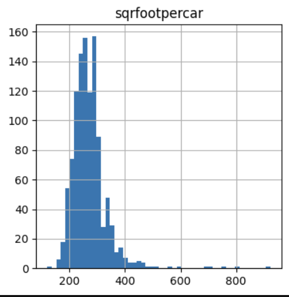
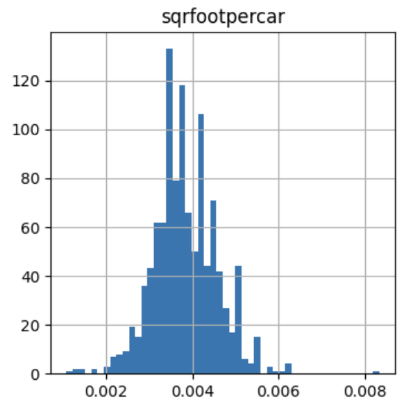
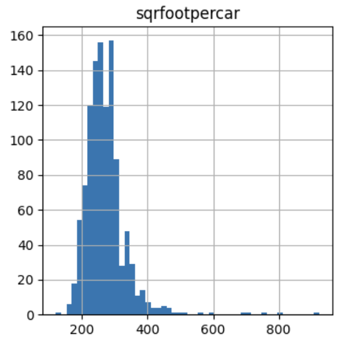
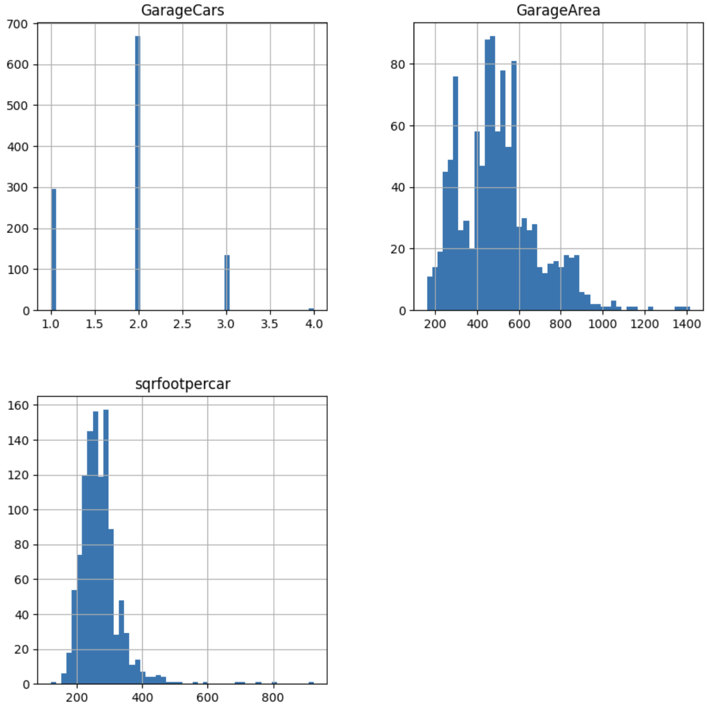
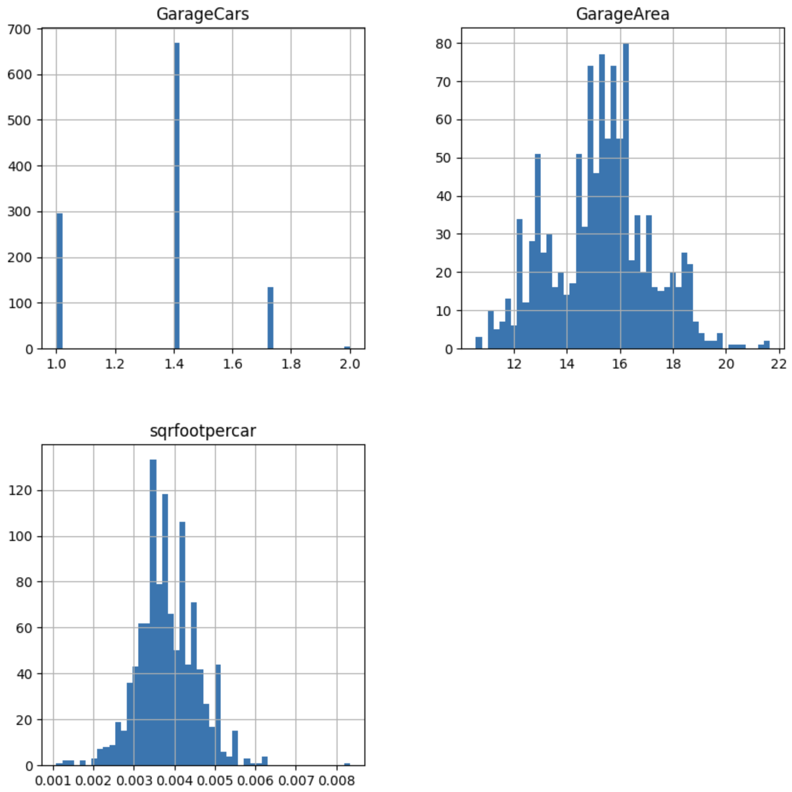

.. _reciprocal:

.. currentmodule:: feature_engine.transformation

ReciprocalTransformer
=====================

A reciprocal transformation involves replacing each data value x, with its reciprocal, 1/x​. This transformation is
useful for addressing heteroscedasticity, where the variability of errors in a regression model differs across values
of an independent variable, and for transforming skewed distributions into more symmetric ones. It can also linearize
certain nonlinear relationships, making them easier to model with linear regression, and improve the overall fit of a
linear model by reducing the influence of outliers or normalizing residuals.

Applications
------------

The reciprocal transformation is useful for ratios, where the values of a variable result from the division of two v
ariables. Some examples include variables like student-teacher ratio (students per teacher) or crop yield (tons per acre).

By calculating the inverse of these variables, we shift from representing students per teacher to teachers per student,
or from tons per acre to acres per ton. This transformation still makes intuitive sense and can result in a better spread
of values, that follow closer a normal distribution.

Properties
----------

- Reciprocal transformation of x is 1 / x
- The inverse of the reciprocal transformation is also the reciprocal transformation
- The range of the reciprocal function includes all real numbers except 0

Although in theory, the reciprocal function is defined for both positive and negative values, in practice, it's mostly
used to transform strictly positive variables.

ReciprocalTransformer
---------------------

The :class:`ReciprocalTransformer` applies the reciprocal transformation to numerical variables. By default, it will
find and transform all numerical variables in the dataset. A better practice would be to apply the transformer to a
selected group of variables, which you can do by passing a list with the variable names to the `variables` parameter
when setting up the transformer.

If any of the variables contains 0 as value, the transformer will raise an error.

Python examples
---------------

In the next sections, we'll demonstrate how to apply the reciprocal transformation with :class:`ReciprocalTransformer`.

We'll load the Ames house prices dataset and create a new variable that represents the square foots per car in the house
garage. Next, we'll separate the data into train and test sets:

.. code:: python

    import matplotlib.pyplot as plt

    from sklearn.datasets import fetch_openml
    from sklearn.model_selection import train_test_split
    from feature_engine.transformation import ReciprocalTransformer

    data = fetch_openml(name='house_prices', as_frame=True)
    data = data.frame

    data["sqrfootpercar"] = data['GarageArea'] / data['GarageCars']
    data = data[~data["sqrfootpercar"].isna()]

    y = data['SalePrice']
    X = data[['GarageCars', 'GarageArea', "sqrfootpercar"]]

    X_train, X_test, y_train, y_test = train_test_split(
        X, y, test_size=0.2, random_state=42)

    print(X_train.head())

In the following output we see the resulting dataset:

.. code:: python

          GarageCars  GarageArea  sqrfootpercar
    1170           1         358          358.0
    330            1         352          352.0
    969            1         264          264.0
    726            2         540          270.0
    1308           2         528          264.0

Let's plot the distribution of the variable with the square foot area per car in a garage:

.. code:: python

    X_train["sqrfootpercar"].hist(bins=50, figsize=(4,4))
    plt.title("sqrfootpercar")
    plt.show()

In the following image we can see the skewness of the variable:

|

Let's now apply the reciprocal transformation to this variable:

.. code:: python

    tf = ReciprocalTransformer(variables="sqrfootpercar")

    train_t = tf.fit_transform(X_train)
    test_t = tf.transform(X_test)

Finally, let's plot the distribution after the reciprocal transformation:

.. code:: python

    train_t["sqrfootpercar"].hist(bins=50, figsize=(4,4))
    plt.title("sqrfootpercar")
    plt.show()

In the following image, we see that the reciprocal transformation made the variable's values follow more closer a
symmetric or normal distribution:

Inverse transformation
~~~~~~~~~~~~~~~~~~~~~~

With :class:`ReciprocalTransformer`, we can easily revert the transformed data to it's original representation, by using
the method `inverse_transform`:

.. code:: python

	train_unt = tf.inverse_transform(train_t)
	test_unt = tf.inverse_transform(test_t)

Let's check out the reverted transformation:

.. code:: python

    train_unt["sqrfootpercar"].hist(bins=50, figsize=(4,4))
    plt.title("sqrfootpercar")
    plt.show()

As you can see in the following image, we obtained the original data by re-applying the reciprocal function to the
transformed variable:

Pipeline of transformations
~~~~~~~~~~~~~~~~~~~~~~~~~~~

As we mentioned previously, the reciprocal transformation is suitable, in general for ratio variables, so we need to
transform other variables in the data set with other type of transformations.

Let's not plot the distribution of the 3 variables in the original data to see which transformations could be suitable
for them:

.. code:: python

    X_train.hist(bins=50, figsize=(10,10))
    plt.show()

In the following plot, we can see that, as expected, `GarageCounts` contains counts (potentially following a Poisson
distribution), and `GarageArea` is a continuous variable:

|

Let's then create a pipeline to apply the square root transformation to `GarageCounts` and the Box-Cox transformation
to `GarageArea`, while applying the reciprocal transformation to "sqrfootpercar":

.. code:: python

    from feature_engine.pipeline import Pipeline
    from feature_engine.transformation import PowerTransformer, BoxCoxTransformer

    from feature_engine.pipeline import Pipeline
    from feature_engine.transformation import PowerTransformer, BoxCoxTransformer

    pipe = Pipeline([
        ("reciprocal", ReciprocalTransformer(variables="sqrfootpercar")),
        ("sqrroot", PowerTransformer(variables="GarageCars", exp=1/2)),
        ("boxcox", BoxCoxTransformer(variables="GarageArea")),
    ])

Let's now fit the pipeline and transform the datasets:

.. code:: python

    train_t = pipe.fit_transform(X_train)
    test_t = pipe.transform(X_test)

And now, we can corroborate how these transformations improved the value spread across all variables by plotting the
histograms for the transformed data:

.. code:: python

    train_t.hist(bins=50, figsize=(10,10))
    plt.show()

In the following image, we can see that the variables no longer show the right-skewness, and now their values are more
symmetrically distributed across their value ranges:

|

An that's it! We've now applied different mathematical functions to stabilize the variance of the variables in the
dataset.

Alternatives to the reciprocal function
---------------------------------------

We mentioned that the reciprocal function is used, in practice, with positive values. If the variable contains negative
values, the Yeo-Johnson transformation, or adding a constant followed by the Box-Cox transformation might be better choices.

If the variable does not come from ratios, then, the log transform or the arcsine transformation can be employed to
handle these cases.

If the variable contains counts, then the square root transformation is better suited.

The Box-Cox transformation automates the process of finding the best transformation by exploring several functions
automatically.

All these functions are considered variance stabilizing transformations, and have been designed to transform data, to
meet the assumptions of statistical parametric tests and linear regression models.

You can apply all these functions out-of-the-box with the transformers from Feature-engine's transformation module.
Remember to follow up the transformations with proper data analysis, to ensure that the transformations returned the desired effect, otherwise, we are adding complexity to the feature engineering pipeline for now added benefit.

Alternatives with Feature-engine
--------------------------------

You can apply other variance data transformation functions with the following transformers:

- :class:`LogTransformer`: applies logarithmic transformation
- :class:`ArcsinTransformer`: applies arcsin transformation
- :class:`PowerTransformer`: applies power transformation including sqrt
- :class:`BoxCoxTransformer`: applies the Box-Cox transformation
- :class:`YeoJohnsonTransformer`: applies the Yeo-Johnson transformation

Additional resources
--------------------

You can find more details about the :class:`ReciprocalTransformer()` here:

- `Jupyter notebook <https://nbviewer.org/github/feature-engine/feature-engine-examples/blob/main/transformation/ReciprocalTransformer.ipynb>`_

For more details about this and other feature engineering methods check out these resources:

.. figure::  ../../images/feml.png
   :width: 300
   :figclass: align-center
   :align: left
   :target: https://www.trainindata.com/p/feature-engineering-for-machine-learning

   Feature Engineering for Machine Learning

|
|
|
|
|
|
|
|
|
|

Or read our book:

.. figure::  ../../images/cookbook.png
   :width: 200
   :figclass: align-center
   :align: left
   :target: https://www.packtpub.com/en-us/product/python-feature-engineering-cookbook-9781835883587

   Python Feature Engineering Cookbook

|
|
|
|
|
|
|
|
|
|
|
|
|

Both our book and course are suitable for beginners and more advanced data scientists
alike. By purchasing them you are supporting Sole, the main developer of Feature-engine.