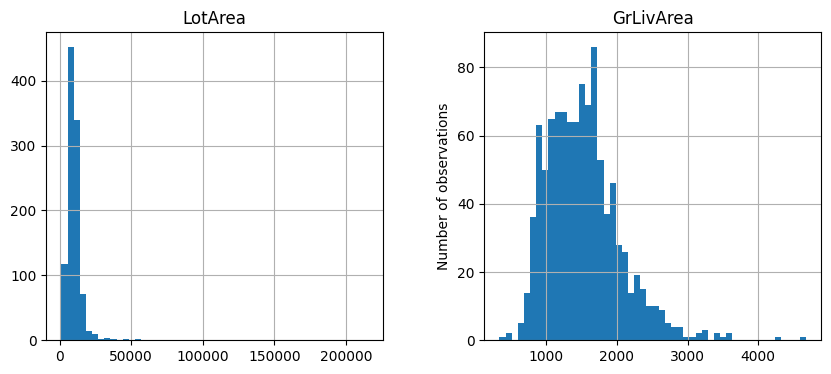
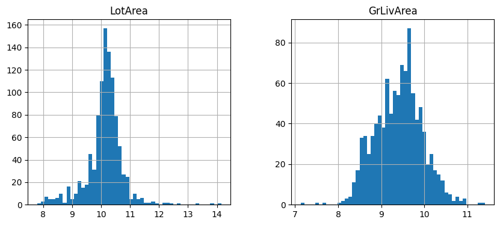

.. _yeojohnson:

.. currentmodule:: feature_engine.transformation

YeoJohnsonTransformer
=====================

The Yeo-Johnson transformation is an extension of the Box-Cox transformation, enabling power transformations on variables with zero and negative values, in addition to positive values.

The Box-Cox transformation, on the other hand, is suitable for numeric variables that are strictly positive. When variables include negative values, we have two options: shift the distribution toward positive values by adding a constant, or use the Yeo-Johnson transformation.

The Yeo-Johnson transformation is defined as:

.. image:: ../../images/yeojohnsonformula.png

where Y is the independent variable and λ is the transformation parameter.

Uses of the Yeo-Johnson and Box-Cox transformation
--------------------------------------------------

Both the Yeo-Johnson and Box-Cox transformations automate the process of identifying the optimal power transformation to approximate a Gaussian distribution. They evaluate various power transformations, including the logarithmic and reciprocal functions, estimating the transformation parameter through maximum likelihood.

These transformations are commonly applied during data preprocessing, particularly when parametric statistical tests or linear models for regression are employed. Such tests and models often have underlying assumptions about the data that may not be inherently satisfied, making these transformations essential for meeting those assumptions. 

Yeo-Johnson vs Box-Cox transformation
-------------------------------------

How does the Yeo-Johnson transformation relate to the Box-Cox transformation?

The Yeo-Johnson transformation extends the Box-Cox transformation to handle variables with zero, negative, and positive values.

- For strictly positive values: The Yeo-Johnson transformation is equivalent to the Box-Cox transformation applied to (X + 1).

- For strictly negative values: The Yeo-Johnson transformation corresponds to the Box-Cox transformation applied to (-X + 1) with a power of (2 — λ), where λ is the transformation parameter.

- For variables with both positive and negative values: The Yeo-Johnson transformation combines the two approaches, using different powers for the positive and negative segments of the variable.

To apply the Yeo-Johnson transformation in Python, you can use `scipy.stats.yeojohnson`, which can transform one variable at a time. For transforming multiple variables simultaneously, libraries like sklearn and Feature-engine are more suitable.

The YeoJohnsonTransformer
-------------------------

The :class:`YeoJohnsonTransformer()` applies the Yeo-Johnson transformation to numeric variables.

Under the hood, `YeoJohnsonTransformer() uses `scipy.stats.yeojohnson <https://docs.scipy.org/doc/scipy/reference/generated/scipy.stats.yeojohnson.html>`_ to apply the transformations to each variable.

Python Implementation
----------------------

In this section, we will apply the Yeo-Johnson transformation to several variables from the Ames house prices dataset. After performing the transformations, we will carry out data analysis to understand the impact on the variable distributions.

Let's begin by importing the necessary libraries and transformers, loading the dataset, and splitting it into training and testing sets.

.. code:: python

	import numpy as np
	import pandas as pd
	import matplotlib.pyplot as plt
	from sklearn.model_selection import train_test_split
	from feature_engine.transformation import YeoJohnsonTransformer

	# Load dataset
	data = fetch_openml(name='house_prices', as_frame=True)
	data = data.frame

	# Separate into train and test sets
	X_train, X_test, y_train, y_test =  train_test_split(
		    data.drop(['Id', 'SalePrice'], axis=1),
		    data['SalePrice'], test_size=0.3, random_state=0)

Let's now apply the Yeo-Johnson transformation to 2 variables; `LotArea` and `GrLivArea`:

.. code:: python

	# set up the variable transformer
	tf = YeoJohnsonTransformer(variables = ['LotArea', 'GrLivArea'])

	# fit the transformer
	tf.fit(X_train)

With `fit()`, :class:`YeoJohnsonTransformer()` learns the optimal lambda for the yeo-johnson power transformation. We can inspect these values as follows:

.. code:: python

         tf.lambda_dict_

We see the optimal lambda values below:

.. code:: python

         {'LotArea': 0.02258978732751055, 'GrLivArea': 0.06781061353154169}

We can now go ahead and transform the dataset to get closer to normal distributions.

.. code:: python

	# transform the data
	train_t= tf.transform(X_train)
	test_t= tf.transform(X_test)

We'll check out the effect of the transformation in the next section.

Effect of the transformation on the variable distribution
~~~~~~~~~~~~~~~~~~~~~~~~~~~~~~~~~~~~~~~~~~~~~~~~~~~~~~~~~

Let's carry out an analysis of transformations. We'll explore the variables distribution before and after applying the transformation described by Yeo and Johnson.
Let's make histograms of the original data to check out the original variables distribution:

.. code:: python

	# un-transformed variable
	X_train[['LotArea', 'GrLivArea']].hist(bins=50)

In the following image, we can observe the skewness in the distribution of 'LotArea' and 'GrLivArea' in the original data:

Now, let's plot histograms of the transformed variables:

.. code:: python

	train_t[['LotArea', 'GrLivArea']].hist(figsize=(10,5))
        plt.show()

We see that in the transformed data, both variables have a more symmetric, Gaussian-like distribution. 

Recovering the original data
~~~~~~~~~~~~~~~~~~~~~~~~~~~~

After applying the Yeo-Johnson transformation, we can restore the original data representation, that is, the original variable values, using the `inverse_transform` method.

.. code:: python

        train_unt = tf.inverse_transform(train_t)
        test_unt = tf.inverse_transform(test_t)

        train_unt[['LotArea','GrLivArea']].hist(figsize=(10,5))
        plt.show()

Applying Yeo-Johnson to variables with zero values
~~~~~~~~~~~~~~~~~~~~~~~~~~~~~~~~~~~~~~~~~~~~~~~~~~~~~~

The variables we have used so far to demonstrate the Yeo-Johnson transformation have been positive.
As mentioned earlier, the Yeo-Johnson transformation is an adaptation of the Box-Cox transformation, designed to handle variables that contain zeros and negative values.

While the Box-Cox transformation can only be applied to strictly positive data, we will now demonstrate how the Yeo-Johnson transformation can be utilized in a dataset with a variable containing zero values:

.. code:: python

        tf0 = YeoJohnsonTransformer(variables = ['PoolArea', 'MiscVal'])
        tf0.fit(X_train)
        train_t= tf0.transform(X_train)
        test_t= tf0.transform(X_test)

Let's plot the distribution of the variables in the original data:

.. code:: python

        # original variables
        X_train[['PoolArea','MiscVal']].hist(figsize=(10,5))

In the following image we see the distribution of the original variables, containing 0 as values:

.. image:: ../../images/untransformedcoupleZerosYJ.png

Let's now display a histogram of the variables after the transformation:

.. code:: python

        # transformed variables
        train_t[['PoolArea','MiscVal']].hist(figsize=(10,5))

.. image:: ../../images/transformedcoupleZerosYJ.png

Unlike the Box-Cox transform, which would raise a value error if the dataset contained zero or negative-valued variables, the Yeo-Johnson transformation supports zeros and negative values without requiring all input variables to be strictly positive.

 
Additional resources
--------------------

You can find more details about the :class:`YeoJohnsonTransformer()` here:

- `Jupyter notebook <https://nbviewer.org/github/feature-engine/feature-engine-examples/blob/main/transformation/YeoJohnsonTransformer.ipynb>`_

For more details about this and other feature engineering methods check out these resources:

.. figure::  ../../images/feml.png
   :width: 300
   :figclass: align-center
   :align: left
   :target: https://www.trainindata.com/p/feature-engineering-for-machine-learning

   Feature Engineering for Machine Learning

|
|
|
|
|
|
|
|
|
|

Or read our book:

.. figure::  ../../images/cookbook.png
   :width: 200
   :figclass: align-center
   :align: left
   :target: https://packt.link/0ewSo

   Python Feature Engineering Cookbook

|
|
|
|
|
|
|
|
|
|
|
|
|

Both our book and course are suitable for beginners and more advanced data scientists
alike. By purchasing them you are supporting Sole, the main developer of Feature-engine.
