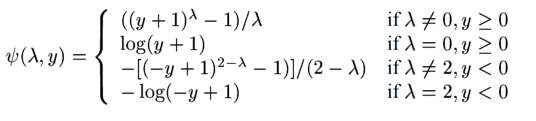
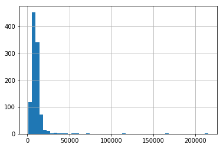
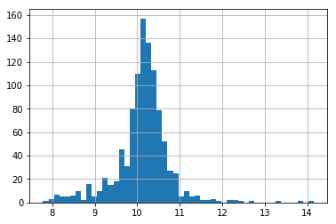

.. _yeojohnson:

.. currentmodule:: feature_engine.transformation

YeoJohnsonTransformer
=====================

The :class:`YeoJohnsonTransformer()` applies the Yeo-Johnson transformation to the numerical variables.

The Yeo-Johnson transformation is defined as:

where Y is the response variable and λ is the transformation parameter.

The Yeo-Johnson transformation implemented by this transformer is that of
`SciPy.stats <https://docs.scipy.org/doc/scipy/reference/generated/scipy.stats.yeojohnson.html>`_.

**Example**

Let's load the house prices dataset and  separate it into train and test sets (more
details about the dataset :ref:`here <datasets>`).

.. code:: python

	import numpy as np
	import pandas as pd
	import matplotlib.pyplot as plt
	from sklearn.model_selection import train_test_split

	from feature_engine import transformation as vt

	# Load dataset
	data = data = pd.read_csv('houseprice.csv')

	# Separate into train and test sets
	X_train, X_test, y_train, y_test =  train_test_split(
		    data.drop(['Id', 'SalePrice'], axis=1),
		    data['SalePrice'], test_size=0.3, random_state=0)

Now we apply the Yeo-Johnson transformation to the 2 indicated variables:

.. code:: python

	# set up the variable transformer
	tf = vt.YeoJohnsonTransformer(variables = ['LotArea', 'GrLivArea'])

	# fit the transformer
	tf.fit(X_train)

With `fit()`, the :class:`YeoJohnsonTransformer()` learns the optimal lambda for the transformation.
Now we can go ahead and trasnform the data:

.. code:: python

	# transform the data
	train_t= tf.transform(X_train)
	test_t= tf.transform(X_test)

Next, we make a histogram of the original variable distribution:

.. code:: python

	# un-transformed variable
	X_train['LotArea'].hist(bins=50)

And now, we can explore the distribution of the variable after the transformation:

.. code:: python

	# transformed variable
	train_t['LotArea'].hist(bins=50)

Additional resources
--------------------

You can find more details about the :class:`YeoJohnsonTransformer()` here:

- `Jupyter notebook <https://nbviewer.org/github/feature-engine/feature-engine-examples/blob/main/transformation/YeoJohnsonTransformer.ipynb>`_

For more details about this and other feature engineering methods check out these resources:

.. figure::  ../../images/feml.png
   :width: 300
   :figclass: align-center
   :align: left
   :target: https://www.trainindata.com/p/feature-engineering-for-machine-learning

   Feature Engineering for Machine Learning

|
|
|
|
|
|
|
|
|
|

Or read our book:

.. figure::  ../../images/cookbook.png
   :width: 200
   :figclass: align-center
   :align: left
   :target: https://packt.link/0ewSo

   Python Feature Engineering Cookbook

|
|
|
|
|
|
|
|
|
|
|
|
|

Both our book and course are suitable for beginners and more advanced data scientists
alike. By purchasing them you are supporting Sole, the main developer of Feature-engine.