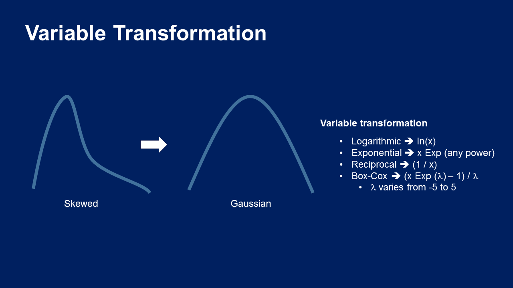

.. -*- mode: rst -*-

Variable Transformation
=======================

Feature-engine's variable transformers transform numerical variables with various
mathematical transformations.

Variable transformations are commonly used to spread the values of the original variables
over a wider value range. See the following illustration:

**Note**

Note however, that improving the value spread is not always possible and it depends
on the nature of the variable.

**Transformers**

.. toctree::
   :maxdepth: 1

   LogTransformer
   LogCpTransformer
   ReciprocalTransformer
   PowerTransformer
   BoxCoxTransformer
   YeoJohnsonTransformer