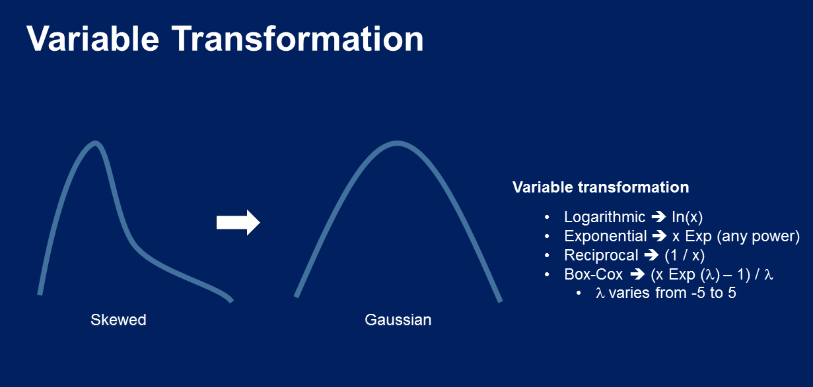

.. -*- mode: rst -*-

Variance Stabilising Transformations
====================================

Feature-engine's variance stabilising transformers transform numerical variables with various
mathematical operations, like logarithm, power, reciprocal, and so on.

Variable transformations are commonly used to spread the values of the original variables
over a wider value range and help meet the assumptions of several statistical models.
See the following illustration:

.. tip::

    To learn more about `**variance stabilising transformations** <https://www.blog.trainindata.com/variance-stabilizing-transformations-in-machine-learning/>`_
    and their role in statistics and  machine learning, check out our very detailed
    `article <https://www.blog.trainindata.com/variance-stabilizing-transformations-in-machine-learning/>`_ in our
    Train in Data Blog.

Supported transformations
-------------------------

================================== ========================= ===================================================== ======================================================================
    Transformer                       Limitations     	  	    Description                                          Suitable for
================================== ========================= ===================================================== ======================================================================
:class:`LogTransformer()`	         Not valid for x<=0         Applies natural or decimal logarithm.                Positive continuous variables with right skew.
:class:`LogCpTransformer()`	               None	                Applies logarithm after adding a constant value.     Continuous variables with a right skew.
:class:`ReciprocalTransformer()`     Not defined for x=0        Applies the reciprocal transformation: 1/x.          Variables representing ratios or proportions, like tons per acre.
:class:`ArcsinTransformer()`         0<= x <= 1                 Applies the arcsin square root transformation.       Probabilities or proportion variables with values between 0 and 1.
:class:`ArcSinhTransformer()`	     	 None                   Applies the inverse hyperbolic sine function.        Similar to log but retaining zero values in a variable.
:class:`PowerTransformer()`	        	 None                   Applies any power transformation x = x**n.           Square root is suitable for count variables. Other powers vary.
:class:`BoxCoxTransformer()`	     Not defined for x<=0       Applies the Box-Cox transformation.
:class:`YeoJohnsonTransformer()`         None                   Applies the Yeo-Johnson transformation.
================================== ========================= ===================================================== ======================================================================

.. note::

    Improving the value spread is not always possible and it depends on the nature of
    the variable.

Transformers
------------

.. toctree::
   :maxdepth: 1

   LogTransformer
   LogCpTransformer
   ReciprocalTransformer
   ArcsinTransformer
   ArcSinhTransformer
   PowerTransformer
   BoxCoxTransformer
   YeoJohnsonTransformer
