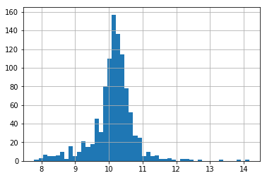

BoxCoxTransformer
=================

The Box-Cox transformation is defined as:

T(Y)=(Y exp(λ)−1)/λ if λ!=0, or log(Y) otherwise.

where Y is the response variable and λ is the transformation parameter. λ varies, typically from -5 to 5.
In the transformation, all values of λ are considered and the optimal value for a given variable is selected.

API Reference
-------------

.. autoclass:: feature_engine.variable_transformers.BoxCoxTransformer
    :members:

Example Use
-----------

.. code:: python

	import numpy as np
	import pandas as pd
	import matplotlib.pyplot as plt
	from sklearn.model_selection import train_test_split

	from feature_engine import variable_transformers as vt

	# Load dataset
	data = data = pd.read_csv('houseprice.csv')

	# Separate into train and test sets
	X_train, X_test, y_train, y_test =  train_test_split(
		    data.drop(['Id', 'SalePrice'], axis=1),
		    data['SalePrice'], test_size=0.3, random_state=0)

	# set up the variable transformer
	tf = vt.BoxCoxTransformer(variables = ['LotArea', 'GrLivArea'])

	# fit the transformer
	tf.fit(X_train)

	# transform the data
	train_t= tf.transform(X_train)
	test_t= tf.transform(X_test)

	# un-transformed variable
	X_train['LotArea'].hist(bins=50)

.. image:: ../images/lotarearaw.png

.. code:: python

	# transformed variable
	train_t['GrLivArea'].hist(bins=50)

